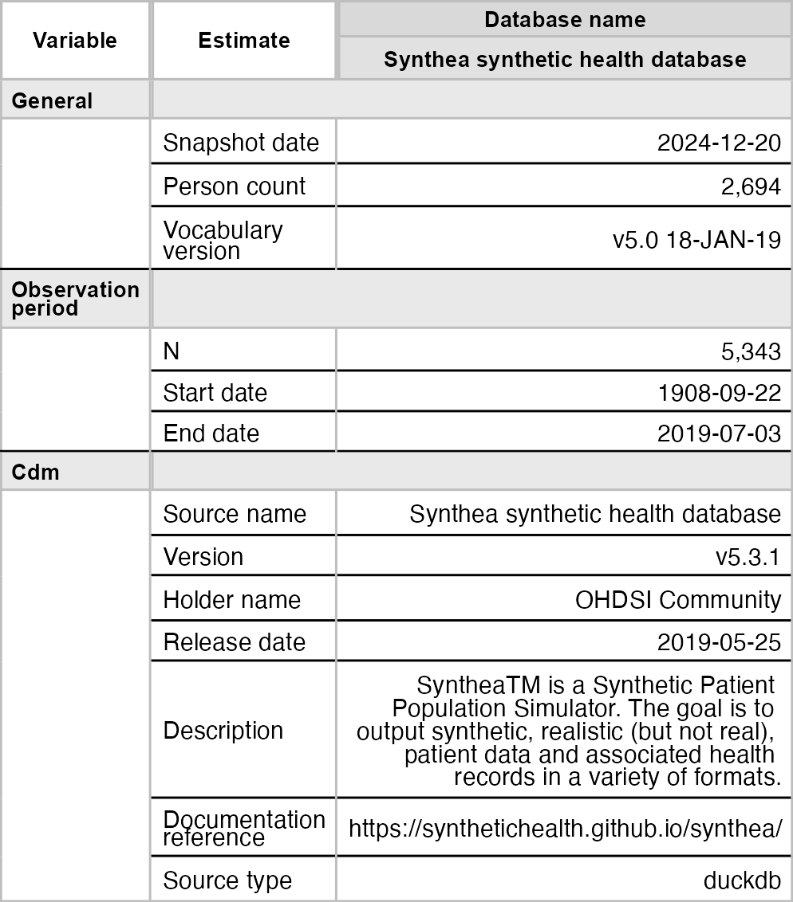
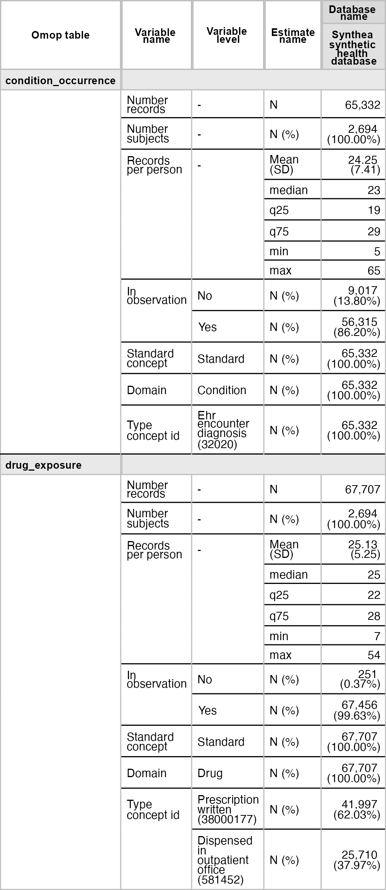
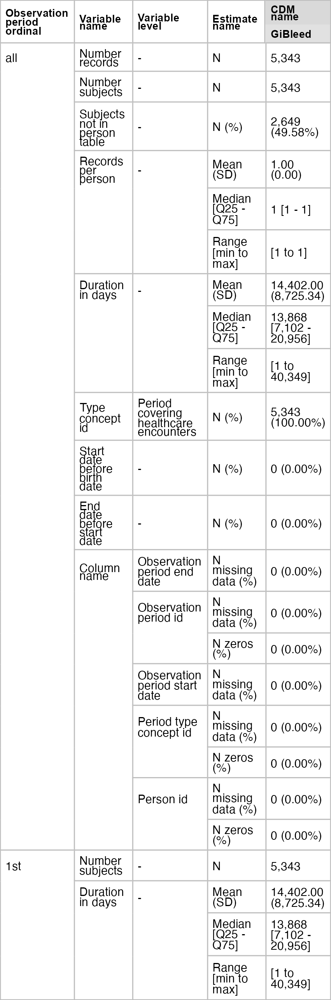
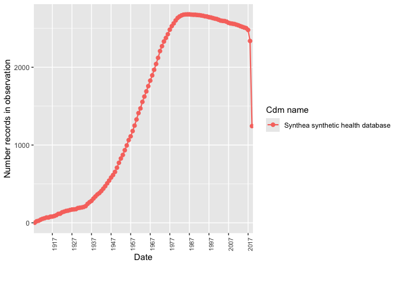
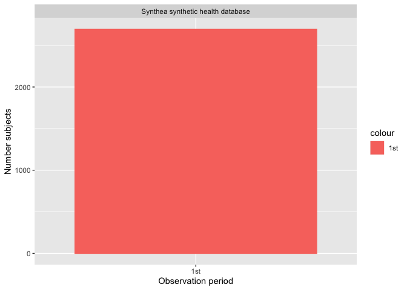
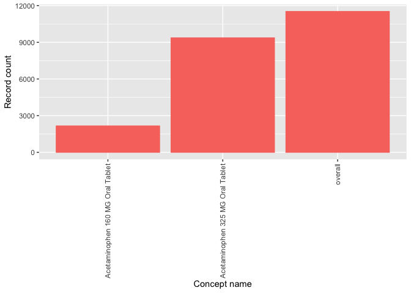

<!-- README.md is generated from README.Rmd. Please edit that file -->

# OmopSketch <a href="https://OHDSI.github.io/OmopSketch/"></a>

<!-- badges: start -->

[](https://lifecycle.r-lib.org/articles/stages.html#experimental)
[](https://github.com/OHDSI/OmopSketch/actions/workflows/R-CMD-check.yaml)
[](https://CRAN.R-project.org/package=OmopSketch)
[](https://app.codecov.io/gh/OHDSI/OmopSketch?branch=main)

<!-- badges: end -->

The goal of OmopSketch is to characterise and visualise an OMOP CDM
instance to asses if it meets the necessary criteria to answer a
specific clinical question and conduct a certain study.

## Installation

You can install the development version of OmopSketch from
[GitHub](https://github.com/) with:

``` r
# install.packages("remotes")
remotes::install_github("OHDSI/OmopSketch")
```

## Example

Let’s start by creating a cdm object using the Eunomia mock dataset:

``` r
library(duckdb)
#> Loading required package: DBI
library(CDMConnector)
library(dplyr, warn.conflicts = FALSE)
library(OmopSketch)
con <- dbConnect(duckdb(), eunomia_dir())
cdm <- cdmFromCon(con = con, cdmSchema = "main", writeSchema = "main")
#> Note: method with signature 'DBIConnection#Id' chosen for function 'dbExistsTable',
#>  target signature 'duckdb_connection#Id'.
#>  "duckdb_connection#ANY" would also be valid
cdm
#> 
#> ── # OMOP CDM reference (duckdb) of Synthea synthetic health database ──────────
#> • omop tables: person, observation_period, visit_occurrence, visit_detail,
#> condition_occurrence, drug_exposure, procedure_occurrence, device_exposure,
#> measurement, observation, death, note, note_nlp, specimen, fact_relationship,
#> location, care_site, provider, payer_plan_period, cost, drug_era, dose_era,
#> condition_era, metadata, cdm_source, concept, vocabulary, domain,
#> concept_class, concept_relationship, relationship, concept_synonym,
#> concept_ancestor, source_to_concept_map, drug_strength
#> • cohort tables: -
#> • achilles tables: -
#> • other tables: -
```

### Snapshot

We first create a snapshot of our database. This will allow us to track
when the analysis has been conducted and capture details about the CDM
version or the data release.

``` r
summariseOmopSnapshot(cdm) |>
  tableOmopSnapshot(type = "flextable")
```



### Characterise the clinical tables

Once we have collected the snapshot information, we can start
characterising the clinical tables of the CDM. By using
`summariseClinicalRecords()` and `tableClinicalRecords()`, we can easily
visualise the main characteristics of specific clinical tables.

``` r
summariseClinicalRecords(cdm, c("condition_occurrence", "drug_exposure")) |>
  tableClinicalRecords(type = "flextable")
#> ℹ Adding variables of interest to condition_occurrence.
#> ℹ Summarising records per person in condition_occurrence.
#> ℹ Summarising condition_occurrence: `in_observation`, `standard_concept`,
#>   `source_vocabulary`, `domain_id`, and `type_concept`.
#> ℹ Adding variables of interest to drug_exposure.
#> ℹ Summarising records per person in drug_exposure.
#> ℹ Summarising drug_exposure: `in_observation`, `standard_concept`,
#>   `source_vocabulary`, `domain_id`, and `type_concept`.
```



We can also explore trends in the clinical table records over time.

``` r
summariseRecordCount(cdm, c("condition_occurrence", "drug_exposure"), interval = "years") |>
  plotRecordCount(facet = "omop_table", colour = "cdm_name")
```



### Characterise the observation period

After visualising the main characteristics of our clinical tables, we
can explore the observation period details. OmopSketch provides several
functions to have an overview the dataset study period.

Using `summariseInObservation()` and `plotInObservation()`, we can
gather information on the number of records per year.

``` r
summariseInObservation(cdm$observation_period, output = "records", interval = "years") |>
  plotInObservation(colour = "cdm_name")
#> `result_id` is not present in result.
#> `result_id` is not present in result.
```



You can also visualise and explore the characteristics of the
observation period per each individual in the database using
`summariseObservationPeriod()`.

``` r
summariseObservationPeriod(cdm$observation_period) |>
  tableObservationPeriod(type = "flextable")
```


Or if visualisation is preferred, you can easily build a histogram to
explore how many participants have more than one observation period.

``` r
summariseObservationPeriod(cdm$observation_period) |>
  plotObservationPeriod(colour = "observation_period_ordinal")
```



### Characterise the concepts

OmopSketch also provides functions to explore some of (or all) the
concepts in the dataset.

``` r
acetaminophen <- c(1125315,  1127433, 1127078)

summariseConceptSetCounts(cdm, conceptSet = list("acetaminophen" = acetaminophen)) |>
  filter(variable_name == "Number records") |> 
  plotConceptSetCounts(colour = "codelist_name")
#> Warning: ! `codelist` contains numeric values, they are casted to integers.
#> ℹ Searching concepts from domain drug in drug_exposure.
#> ℹ Counting concepts
```



As seen, OmopSketch offers multiple functionalities to provide a general
overview of a database. Additionally, it includes more tools and
arguments that allow for deeper exploration, helping to assess the
database’s suitability for specific research studies. For further
information, please refer to the vignettes.
