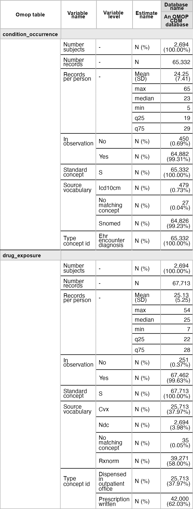
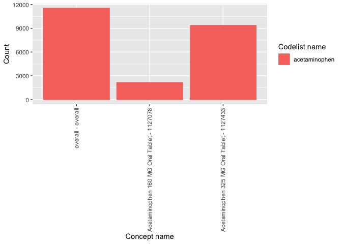

<!-- README.md is generated from README.Rmd. Please edit that file -->

# OmopSketch <a href="https://OHDSI.github.io/OmopSketch/"></a>

<!-- badges: start -->

[](https://lifecycle.r-lib.org/articles/stages.html#stable)
[](https://github.com/OHDSI/OmopSketch/actions/workflows/R-CMD-check.yaml)
[](https://CRAN.R-project.org/package=OmopSketch)
[](https://app.codecov.io/gh/OHDSI/OmopSketch?branch=main)

<!-- badges: end -->

The goal of OmopSketch is to characterise and visualise an OMOP CDM
instance to asses if it meets the necessary criteria to answer a
specific clinical question and conduct a certain study.

## Installation

You can install the development version of OmopSketch from
[GitHub](https://github.com/) with:

``` r
# install.packages("remotes")
remotes::install_github("OHDSI/OmopSketch")
```

## Example

Let’s start by creating a cdm object using the Eunomia GiBleed mock
dataset:

``` r
visOmopResults::setGlobalTableOptions(style = here::here("inst", "scarlet.yml"))
visOmopResults::setGlobalPlotOptions(style = here::here("inst", "scarlet.yml"))
```

``` r
library(duckdb)
#> Loading required package: DBI
library(dplyr, warn.conflicts = FALSE)
library(OmopSketch)

cdm <- omock::mockCdmFromDataset(datasetName = "GiBleed", source = "duckdb")
#> ℹ Reading GiBleed tables.
#> ℹ Adding drug_strength table.
#> ℹ Creating local <cdm_reference> object.
#> ℹ Inserting <cdm_reference> into duckdb.
cdm
#> 
#> ── # OMOP CDM reference (duckdb) of GiBleed ────────────────────────────────────
#> • omop tables: care_site, cdm_source, concept, concept_ancestor, concept_class,
#> concept_relationship, concept_synonym, condition_era, condition_occurrence,
#> cost, death, device_exposure, domain, dose_era, drug_era, drug_exposure,
#> drug_strength, fact_relationship, location, measurement, metadata, note,
#> note_nlp, observation, observation_period, payer_plan_period, person,
#> procedure_occurrence, provider, relationship, source_to_concept_map, specimen,
#> visit_detail, visit_occurrence, vocabulary
#> • cohort tables: -
#> • achilles tables: -
#> • other tables: -
```

### Snapshot

We first create a snapshot of our database. This will allow us to track
when the analysis has been conducted and capture details about the CDM
version or the data release.

``` r
summariseOmopSnapshot(cdm) |>
  tableOmopSnapshot(type = "flextable")
```



### Characterise the clinical tables

Once we have collected the snapshot information, we can start
characterising the clinical tables of the CDM. By using
`summariseClinicalRecords()` and `tableClinicalRecords()`, we can easily
visualise the main characteristics of specific clinical tables.

``` r
summariseClinicalRecords(cdm, c("condition_occurrence", "drug_exposure")) |>
  tableClinicalRecords(type = "flextable")
#> ℹ Adding variables of interest to condition_occurrence.
#> ℹ Summarising records per person in condition_occurrence.
#> ℹ Summarising subjects not in person table in condition_occurrence.
#> ℹ Summarising records in observation in condition_occurrence.
#> ℹ Summarising records with start before birth date in condition_occurrence.
#> ℹ Summarising records with end date before start date in condition_occurrence.
#> ℹ Summarising domains in condition_occurrence.
#> ℹ Summarising standard concepts in condition_occurrence.
#> ℹ Summarising source vocabularies in condition_occurrence.
#> ℹ Summarising concept types in condition_occurrence.
#> ℹ Summarising missing data in condition_occurrence.
#> ℹ Adding variables of interest to drug_exposure.
#> ℹ Summarising records per person in drug_exposure.
#> ℹ Summarising subjects not in person table in drug_exposure.
#> ℹ Summarising records in observation in drug_exposure.
#> ℹ Summarising records with start before birth date in drug_exposure.
#> ℹ Summarising records with end date before start date in drug_exposure.
#> ℹ Summarising domains in drug_exposure.
#> ℹ Summarising standard concepts in drug_exposure.
#> ℹ Summarising source vocabularies in drug_exposure.
#> ℹ Summarising concept types in drug_exposure.
#> ℹ Summarising concept class in drug_exposure.
#> ℹ Summarising missing data in drug_exposure.
```


### Characterise the observation period

After visualising the main characteristics of our clinical tables, we
can explore the observation period details. You can visualise and
explore the characteristics of the observation period per each
individual in the database using `summariseObservationPeriod()`.

``` r
summariseObservationPeriod(cdm) |>
  tableObservationPeriod(type = "flextable")
#> Warning: ! There are 2649 individuals not included in the person table.
```


Or if visualisation is preferred, you can easily build a histogram to
explore how many participants have more than one observation period.

``` r
summariseObservationPeriod(cdm) |>
  plotObservationPeriod(colour = "observation_period_ordinal")
#> Warning: ! There are 2649 individuals not included in the person table.
```


### Explore trends over time

We can also explore trends over time using `summariseTrend()`.

``` r
summariseTrend(cdm, event = c("condition_occurrence", "drug_exposure"), output = "record",  interval = "years") |>
  plotTrend(facet = "omop_table", colour = "cdm_name")
```


### Characterise the concepts

OmopSketch also provides functions to explore the concepts in the
dataset.

``` r
summariseConceptIdCounts(cdm, omopTableName = "drug_exposure") |>
  tableTopConceptCounts(type = "flextable")
```



### Characterise the cdm

To obtain and explore a complete characterisation of a cdm, you can use
the OmopSketch functions `databaseCharacteristics()` and
`shinyCharacteristics()`. These functions allow you to generate and
interactively explore detailed summaries of your database. To see an
example of the outputs produced, explore the characterisation of several
synthetic datasets
[here](https://dpa-pde-oxford.shinyapps.io/OmopSketchCharacterisation/).

As seen, OmopSketch offers multiple functionalities to provide a general
overview of a database. Additionally, it includes more tools and
arguments that allow for deeper exploration, helping to assess the
database’s suitability for specific research studies. For further
information, please refer to the vignettes.
