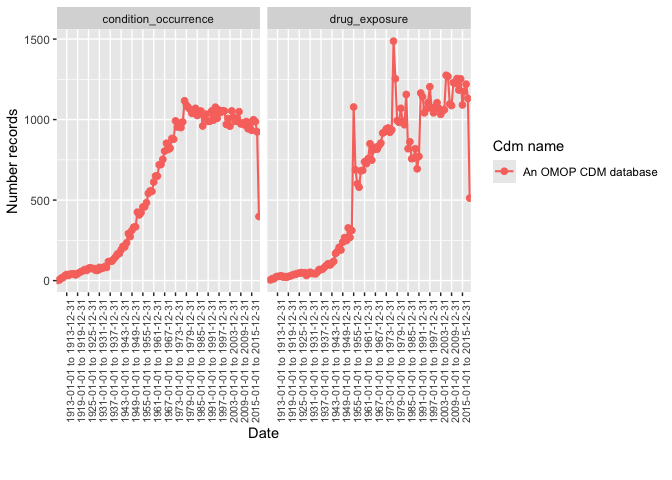

<!-- README.md is generated from README.Rmd. Please edit that file -->

# OmopSketch <a href="https://oxford-pharmacoepi.github.io/OmopSketch/"></a>

<!-- badges: start -->

[](https://lifecycle.r-lib.org/articles/stages.html#experimental)
[](https://github.com/oxford-pharmacoepi/OmopSketch/actions/workflows/R-CMD-check.yaml)
[](https://CRAN.R-project.org/package=OmopSketch)
[](https://app.codecov.io/gh/oxford-pharmacoepi/OmopSketch?branch=main)
<!-- badges: end -->

### WARNING: this package is under-development

The goal of OmopSketch is to characterise and visualise an OMOP CDM
instance to asses if it meets the necessary criteria to answer a
specific clinical question and conduct a certain study.

## Installation

You can install the development version of OmopSketch from
[GitHub](https://github.com/) with:

``` r
# install.packages("remotes")
remotes::install_github("oxford-pharmacoepi/OmopSketch")
```

## Example

Let’s start by creating a cdm object using the Eunomia mock dataset:

``` r
library(duckdb)
#> Warning: package 'duckdb' was built under R version 4.3.3
#> Loading required package: DBI
#> Warning: package 'DBI' was built under R version 4.3.3
library(CDMConnector)
#> Warning: package 'CDMConnector' was built under R version 4.3.3
library(dplyr)
#> 
#> Attaching package: 'dplyr'
#> The following objects are masked from 'package:stats':
#> 
#>     filter, lag
#> The following objects are masked from 'package:base':
#> 
#>     intersect, setdiff, setequal, union
library(OmopSketch)
con <- dbConnect(duckdb(), eunomia_dir())
cdm <- cdmFromCon(con = con, cdmSchema = "main", writeSchema = "main")
#> Note: method with signature 'DBIConnection#Id' chosen for function 'dbExistsTable',
#>  target signature 'duckdb_connection#Id'.
#>  "duckdb_connection#ANY" would also be valid
cdm
#> 
#> ── # OMOP CDM reference (duckdb) of Synthea synthetic health database ──────────
#> • omop tables: person, observation_period, visit_occurrence, visit_detail,
#> condition_occurrence, drug_exposure, procedure_occurrence, device_exposure,
#> measurement, observation, death, note, note_nlp, specimen, fact_relationship,
#> location, care_site, provider, payer_plan_period, cost, drug_era, dose_era,
#> condition_era, metadata, cdm_source, concept, vocabulary, domain,
#> concept_class, concept_relationship, relationship, concept_synonym,
#> concept_ancestor, source_to_concept_map, drug_strength
#> • cohort tables: -
#> • achilles tables: -
#> • other tables: -
```

### Snapshot

We first create a snapshot of our database. This will allow us to track
when the analysis has been conducted and capture details about the CDM
version or the data release.

``` r
summariseOmopSnapshot(cdm)
#> # A tibble: 13 × 13
#>    result_id cdm_name            group_name group_level strata_name strata_level
#>        <int> <chr>               <chr>      <chr>       <chr>       <chr>       
#>  1         1 Synthea synthetic … overall    overall     overall     overall     
#>  2         1 Synthea synthetic … overall    overall     overall     overall     
#>  3         1 Synthea synthetic … overall    overall     overall     overall     
#>  4         1 Synthea synthetic … overall    overall     overall     overall     
#>  5         1 Synthea synthetic … overall    overall     overall     overall     
#>  6         1 Synthea synthetic … overall    overall     overall     overall     
#>  7         1 Synthea synthetic … overall    overall     overall     overall     
#>  8         1 Synthea synthetic … overall    overall     overall     overall     
#>  9         1 Synthea synthetic … overall    overall     overall     overall     
#> 10         1 Synthea synthetic … overall    overall     overall     overall     
#> 11         1 Synthea synthetic … overall    overall     overall     overall     
#> 12         1 Synthea synthetic … overall    overall     overall     overall     
#> 13         1 Synthea synthetic … overall    overall     overall     overall     
#> # ℹ 7 more variables: variable_name <chr>, variable_level <chr>,
#> #   estimate_name <chr>, estimate_type <chr>, estimate_value <chr>,
#> #   additional_name <chr>, additional_level <chr>
# ADD TABLE OMOP SNAPSHOT
```

### Characterise the clinical tables

Once we have collected the snapshot information, we can start
characteristing the clinical tables of the CDM. By using
`summariseClinicalRecords()` and `tableClinicalRecords()`, we can easily
visualise the main characteristics of specific clinical tables.

``` r
summariseClinicalRecords(cdm, c("condition_occurrence", "drug_exposure")) |>
  tableClinicalRecords()
#> ℹ Summarising table counts
#> ℹ Summarising records per person
#> ℹ Summarising in observation, standard, domain id, and type information
#> ℹ Summarising table counts
#> ℹ Summarising records per person
#> ℹ Summarising in observation, standard, domain id, and type information
```

<div id="hejhklktgv" style="padding-left:0px;padding-right:0px;padding-top:10px;padding-bottom:10px;overflow-x:auto;overflow-y:auto;width:auto;height:auto;">
<style>#hejhklktgv table {
  font-family: system-ui, 'Segoe UI', Roboto, Helvetica, Arial, sans-serif, 'Apple Color Emoji', 'Segoe UI Emoji', 'Segoe UI Symbol', 'Noto Color Emoji';
  -webkit-font-smoothing: antialiased;
  -moz-osx-font-smoothing: grayscale;
}
&#10;#hejhklktgv thead, #hejhklktgv tbody, #hejhklktgv tfoot, #hejhklktgv tr, #hejhklktgv td, #hejhklktgv th {
  border-style: none;
}
&#10;#hejhklktgv p {
  margin: 0;
  padding: 0;
}
&#10;#hejhklktgv .gt_table {
  display: table;
  border-collapse: collapse;
  line-height: normal;
  margin-left: auto;
  margin-right: auto;
  color: #333333;
  font-size: 16px;
  font-weight: normal;
  font-style: normal;
  background-color: #FFFFFF;
  width: auto;
  border-top-style: solid;
  border-top-width: 2px;
  border-top-color: #A8A8A8;
  border-right-style: none;
  border-right-width: 2px;
  border-right-color: #D3D3D3;
  border-bottom-style: solid;
  border-bottom-width: 2px;
  border-bottom-color: #A8A8A8;
  border-left-style: none;
  border-left-width: 2px;
  border-left-color: #D3D3D3;
}
&#10;#hejhklktgv .gt_caption {
  padding-top: 4px;
  padding-bottom: 4px;
}
&#10;#hejhklktgv .gt_title {
  color: #333333;
  font-size: 125%;
  font-weight: initial;
  padding-top: 4px;
  padding-bottom: 4px;
  padding-left: 5px;
  padding-right: 5px;
  border-bottom-color: #FFFFFF;
  border-bottom-width: 0;
}
&#10;#hejhklktgv .gt_subtitle {
  color: #333333;
  font-size: 85%;
  font-weight: initial;
  padding-top: 3px;
  padding-bottom: 5px;
  padding-left: 5px;
  padding-right: 5px;
  border-top-color: #FFFFFF;
  border-top-width: 0;
}
&#10;#hejhklktgv .gt_heading {
  background-color: #FFFFFF;
  text-align: center;
  border-bottom-color: #FFFFFF;
  border-left-style: none;
  border-left-width: 1px;
  border-left-color: #D3D3D3;
  border-right-style: none;
  border-right-width: 1px;
  border-right-color: #D3D3D3;
}
&#10;#hejhklktgv .gt_bottom_border {
  border-bottom-style: solid;
  border-bottom-width: 2px;
  border-bottom-color: #D3D3D3;
}
&#10;#hejhklktgv .gt_col_headings {
  border-top-style: solid;
  border-top-width: 2px;
  border-top-color: #D3D3D3;
  border-bottom-style: solid;
  border-bottom-width: 2px;
  border-bottom-color: #D3D3D3;
  border-left-style: none;
  border-left-width: 1px;
  border-left-color: #D3D3D3;
  border-right-style: none;
  border-right-width: 1px;
  border-right-color: #D3D3D3;
}
&#10;#hejhklktgv .gt_col_heading {
  color: #333333;
  background-color: #FFFFFF;
  font-size: 100%;
  font-weight: normal;
  text-transform: inherit;
  border-left-style: none;
  border-left-width: 1px;
  border-left-color: #D3D3D3;
  border-right-style: none;
  border-right-width: 1px;
  border-right-color: #D3D3D3;
  vertical-align: bottom;
  padding-top: 5px;
  padding-bottom: 6px;
  padding-left: 5px;
  padding-right: 5px;
  overflow-x: hidden;
}
&#10;#hejhklktgv .gt_column_spanner_outer {
  color: #333333;
  background-color: #FFFFFF;
  font-size: 100%;
  font-weight: normal;
  text-transform: inherit;
  padding-top: 0;
  padding-bottom: 0;
  padding-left: 4px;
  padding-right: 4px;
}
&#10;#hejhklktgv .gt_column_spanner_outer:first-child {
  padding-left: 0;
}
&#10;#hejhklktgv .gt_column_spanner_outer:last-child {
  padding-right: 0;
}
&#10;#hejhklktgv .gt_column_spanner {
  border-bottom-style: solid;
  border-bottom-width: 2px;
  border-bottom-color: #D3D3D3;
  vertical-align: bottom;
  padding-top: 5px;
  padding-bottom: 5px;
  overflow-x: hidden;
  display: inline-block;
  width: 100%;
}
&#10;#hejhklktgv .gt_spanner_row {
  border-bottom-style: hidden;
}
&#10;#hejhklktgv .gt_group_heading {
  padding-top: 8px;
  padding-bottom: 8px;
  padding-left: 5px;
  padding-right: 5px;
  color: #333333;
  background-color: #FFFFFF;
  font-size: 100%;
  font-weight: initial;
  text-transform: inherit;
  border-top-style: solid;
  border-top-width: 2px;
  border-top-color: #D3D3D3;
  border-bottom-style: solid;
  border-bottom-width: 2px;
  border-bottom-color: #D3D3D3;
  border-left-style: none;
  border-left-width: 1px;
  border-left-color: #D3D3D3;
  border-right-style: none;
  border-right-width: 1px;
  border-right-color: #D3D3D3;
  vertical-align: middle;
  text-align: left;
}
&#10;#hejhklktgv .gt_empty_group_heading {
  padding: 0.5px;
  color: #333333;
  background-color: #FFFFFF;
  font-size: 100%;
  font-weight: initial;
  border-top-style: solid;
  border-top-width: 2px;
  border-top-color: #D3D3D3;
  border-bottom-style: solid;
  border-bottom-width: 2px;
  border-bottom-color: #D3D3D3;
  vertical-align: middle;
}
&#10;#hejhklktgv .gt_from_md > :first-child {
  margin-top: 0;
}
&#10;#hejhklktgv .gt_from_md > :last-child {
  margin-bottom: 0;
}
&#10;#hejhklktgv .gt_row {
  padding-top: 8px;
  padding-bottom: 8px;
  padding-left: 5px;
  padding-right: 5px;
  margin: 10px;
  border-top-style: solid;
  border-top-width: 1px;
  border-top-color: #D3D3D3;
  border-left-style: none;
  border-left-width: 1px;
  border-left-color: #D3D3D3;
  border-right-style: none;
  border-right-width: 1px;
  border-right-color: #D3D3D3;
  vertical-align: middle;
  overflow-x: hidden;
}
&#10;#hejhklktgv .gt_stub {
  color: #333333;
  background-color: #FFFFFF;
  font-size: 100%;
  font-weight: initial;
  text-transform: inherit;
  border-right-style: solid;
  border-right-width: 2px;
  border-right-color: #D3D3D3;
  padding-left: 5px;
  padding-right: 5px;
}
&#10;#hejhklktgv .gt_stub_row_group {
  color: #333333;
  background-color: #FFFFFF;
  font-size: 100%;
  font-weight: initial;
  text-transform: inherit;
  border-right-style: solid;
  border-right-width: 2px;
  border-right-color: #D3D3D3;
  padding-left: 5px;
  padding-right: 5px;
  vertical-align: top;
}
&#10;#hejhklktgv .gt_row_group_first td {
  border-top-width: 2px;
}
&#10;#hejhklktgv .gt_row_group_first th {
  border-top-width: 2px;
}
&#10;#hejhklktgv .gt_summary_row {
  color: #333333;
  background-color: #FFFFFF;
  text-transform: inherit;
  padding-top: 8px;
  padding-bottom: 8px;
  padding-left: 5px;
  padding-right: 5px;
}
&#10;#hejhklktgv .gt_first_summary_row {
  border-top-style: solid;
  border-top-color: #D3D3D3;
}
&#10;#hejhklktgv .gt_first_summary_row.thick {
  border-top-width: 2px;
}
&#10;#hejhklktgv .gt_last_summary_row {
  padding-top: 8px;
  padding-bottom: 8px;
  padding-left: 5px;
  padding-right: 5px;
  border-bottom-style: solid;
  border-bottom-width: 2px;
  border-bottom-color: #D3D3D3;
}
&#10;#hejhklktgv .gt_grand_summary_row {
  color: #333333;
  background-color: #FFFFFF;
  text-transform: inherit;
  padding-top: 8px;
  padding-bottom: 8px;
  padding-left: 5px;
  padding-right: 5px;
}
&#10;#hejhklktgv .gt_first_grand_summary_row {
  padding-top: 8px;
  padding-bottom: 8px;
  padding-left: 5px;
  padding-right: 5px;
  border-top-style: double;
  border-top-width: 6px;
  border-top-color: #D3D3D3;
}
&#10;#hejhklktgv .gt_last_grand_summary_row_top {
  padding-top: 8px;
  padding-bottom: 8px;
  padding-left: 5px;
  padding-right: 5px;
  border-bottom-style: double;
  border-bottom-width: 6px;
  border-bottom-color: #D3D3D3;
}
&#10;#hejhklktgv .gt_striped {
  background-color: rgba(128, 128, 128, 0.05);
}
&#10;#hejhklktgv .gt_table_body {
  border-top-style: solid;
  border-top-width: 2px;
  border-top-color: #D3D3D3;
  border-bottom-style: solid;
  border-bottom-width: 2px;
  border-bottom-color: #D3D3D3;
}
&#10;#hejhklktgv .gt_footnotes {
  color: #333333;
  background-color: #FFFFFF;
  border-bottom-style: none;
  border-bottom-width: 2px;
  border-bottom-color: #D3D3D3;
  border-left-style: none;
  border-left-width: 2px;
  border-left-color: #D3D3D3;
  border-right-style: none;
  border-right-width: 2px;
  border-right-color: #D3D3D3;
}
&#10;#hejhklktgv .gt_footnote {
  margin: 0px;
  font-size: 90%;
  padding-top: 4px;
  padding-bottom: 4px;
  padding-left: 5px;
  padding-right: 5px;
}
&#10;#hejhklktgv .gt_sourcenotes {
  color: #333333;
  background-color: #FFFFFF;
  border-bottom-style: none;
  border-bottom-width: 2px;
  border-bottom-color: #D3D3D3;
  border-left-style: none;
  border-left-width: 2px;
  border-left-color: #D3D3D3;
  border-right-style: none;
  border-right-width: 2px;
  border-right-color: #D3D3D3;
}
&#10;#hejhklktgv .gt_sourcenote {
  font-size: 90%;
  padding-top: 4px;
  padding-bottom: 4px;
  padding-left: 5px;
  padding-right: 5px;
}
&#10;#hejhklktgv .gt_left {
  text-align: left;
}
&#10;#hejhklktgv .gt_center {
  text-align: center;
}
&#10;#hejhklktgv .gt_right {
  text-align: right;
  font-variant-numeric: tabular-nums;
}
&#10;#hejhklktgv .gt_font_normal {
  font-weight: normal;
}
&#10;#hejhklktgv .gt_font_bold {
  font-weight: bold;
}
&#10;#hejhklktgv .gt_font_italic {
  font-style: italic;
}
&#10;#hejhklktgv .gt_super {
  font-size: 65%;
}
&#10;#hejhklktgv .gt_footnote_marks {
  font-size: 75%;
  vertical-align: 0.4em;
  position: initial;
}
&#10;#hejhklktgv .gt_asterisk {
  font-size: 100%;
  vertical-align: 0;
}
&#10;#hejhklktgv .gt_indent_1 {
  text-indent: 5px;
}
&#10;#hejhklktgv .gt_indent_2 {
  text-indent: 10px;
}
&#10;#hejhklktgv .gt_indent_3 {
  text-indent: 15px;
}
&#10;#hejhklktgv .gt_indent_4 {
  text-indent: 20px;
}
&#10;#hejhklktgv .gt_indent_5 {
  text-indent: 25px;
}
&#10;#hejhklktgv .katex-display {
  display: inline-flex !important;
  margin-bottom: 0.75em !important;
}
&#10;#hejhklktgv div.Reactable > div.rt-table > div.rt-thead > div.rt-tr.rt-tr-group-header > div.rt-th-group:after {
  height: 0px !important;
}
</style>
<table class="gt_table" data-quarto-disable-processing="false" data-quarto-bootstrap="false">
  <thead>
    <tr class="gt_col_headings gt_spanner_row">
      <th class="gt_col_heading gt_columns_bottom_border gt_left" rowspan="2" colspan="1" style="text-align: center; font-weight: bold;" scope="col" id="Variable">Variable</th>
      <th class="gt_col_heading gt_columns_bottom_border gt_left" rowspan="2" colspan="1" style="text-align: center; font-weight: bold;" scope="col" id="Level">Level</th>
      <th class="gt_col_heading gt_columns_bottom_border gt_left" rowspan="2" colspan="1" style="text-align: center; font-weight: bold;" scope="col" id="Estimate">Estimate</th>
      <th class="gt_center gt_columns_top_border gt_column_spanner_outer" rowspan="1" colspan="1" style="background-color: #D9D9D9; text-align: center; font-weight: bold;" scope="col" id="cdm_name">
        <span class="gt_column_spanner">cdm_name</span>
      </th>
    </tr>
    <tr class="gt_col_headings">
      <th class="gt_col_heading gt_columns_bottom_border gt_left" rowspan="1" colspan="1" style="background-color: #E1E1E1; text-align: center; font-weight: bold;" scope="col" id="Synthea synthetic health database">Synthea synthetic health database</th>
    </tr>
  </thead>
  <tbody class="gt_table_body">
    <tr class="gt_group_heading_row">
      <th colspan="4" class="gt_group_heading" style="background-color: #E9E9E9; font-weight: bold;" scope="colgroup" id="condition_occurrence">condition_occurrence</th>
    </tr>
    <tr class="gt_row_group_first"><td headers="condition_occurrence  Variable" class="gt_row gt_left" style="text-align: left; border-left-width: 2px; border-left-style: solid; border-left-color: transparent; border-right-width: 1px; border-right-style: solid; border-right-color: #D3D3D3; border-top-width: 1px; border-top-style: solid; border-top-color: #D3D3D3; border-bottom-width: 1px; border-bottom-style: solid; border-bottom-color: #D3D3D3;">Number of subjects</td>
<td headers="condition_occurrence  Level" class="gt_row gt_left" style="text-align: left; border-left-width: 1px; border-left-style: solid; border-left-color: #D3D3D3; border-right-width: 1px; border-right-style: solid; border-right-color: #D3D3D3; border-top-width: 1px; border-top-style: solid; border-top-color: #D3D3D3; border-bottom-width: 1px; border-bottom-style: solid; border-bottom-color: #D3D3D3;">-</td>
<td headers="condition_occurrence  Estimate" class="gt_row gt_left" style="text-align: left; border-left-width: 1px; border-left-style: solid; border-left-color: #D3D3D3; border-right-width: 1px; border-right-style: solid; border-right-color: #D3D3D3; border-top-width: 1px; border-top-style: solid; border-top-color: #D3D3D3; border-bottom-width: 1px; border-bottom-style: solid; border-bottom-color: #D3D3D3;">N (%)</td>
<td headers="condition_occurrence  [header_name]cdm_name
[header_level]Synthea synthetic health database" class="gt_row gt_left" style="text-align: right; border-right-width: 2px; border-right-style: solid; border-right-color: transparent;">2,694 (100.0%)</td></tr>
    <tr><td headers="condition_occurrence  Variable" class="gt_row gt_left" style="text-align: left; border-left-width: 2px; border-left-style: solid; border-left-color: transparent; border-right-width: 1px; border-right-style: solid; border-right-color: #D3D3D3; border-top-width: 1px; border-top-style: solid; border-top-color: #D3D3D3; border-bottom-width: 1px; border-bottom-style: solid; border-bottom-color: #D3D3D3;">Number of records</td>
<td headers="condition_occurrence  Level" class="gt_row gt_left" style="text-align: left; border-left-width: 1px; border-left-style: solid; border-left-color: #D3D3D3; border-right-width: 1px; border-right-style: solid; border-right-color: #D3D3D3; border-top-width: 1px; border-top-style: solid; border-top-color: #D3D3D3; border-bottom-width: 1px; border-bottom-style: solid; border-bottom-color: #D3D3D3;">-</td>
<td headers="condition_occurrence  Estimate" class="gt_row gt_left" style="text-align: left; border-left-width: 1px; border-left-style: solid; border-left-color: #D3D3D3; border-right-width: 1px; border-right-style: solid; border-right-color: #D3D3D3; border-top-width: 1px; border-top-style: solid; border-top-color: #D3D3D3; border-bottom-width: 1px; border-bottom-style: solid; border-bottom-color: #D3D3D3;">N</td>
<td headers="condition_occurrence  [header_name]cdm_name
[header_level]Synthea synthetic health database" class="gt_row gt_left" style="text-align: right; border-right-width: 2px; border-right-style: solid; border-right-color: transparent;">65,332</td></tr>
    <tr><td headers="condition_occurrence  Variable" class="gt_row gt_left" style="text-align: left; border-left-width: 2px; border-left-style: solid; border-left-color: transparent; border-right-width: 1px; border-right-style: solid; border-right-color: #D3D3D3; border-top-width: 1px; border-top-style: solid; border-top-color: #D3D3D3; border-bottom-width: 1px; border-bottom-style: solid; border-bottom-color: #D3D3D3;">Records per person</td>
<td headers="condition_occurrence  Level" class="gt_row gt_left" style="text-align: left; border-left-width: 1px; border-left-style: solid; border-left-color: #D3D3D3; border-right-width: 1px; border-right-style: solid; border-right-color: #D3D3D3; border-top-width: 1px; border-top-style: solid; border-top-color: #D3D3D3; border-bottom-width: 1px; border-bottom-style: solid; border-bottom-color: #D3D3D3;">-</td>
<td headers="condition_occurrence  Estimate" class="gt_row gt_left" style="text-align: left; border-left-width: 1px; border-left-style: solid; border-left-color: #D3D3D3; border-right-width: 1px; border-right-style: solid; border-right-color: #D3D3D3; border-top-width: 1px; border-top-style: solid; border-top-color: #D3D3D3; border-bottom-width: 1px; border-bottom-style: solid; border-bottom-color: #D3D3D3;">median [IQR]</td>
<td headers="condition_occurrence  [header_name]cdm_name
[header_level]Synthea synthetic health database" class="gt_row gt_left" style="text-align: right; border-right-width: 2px; border-right-style: solid; border-right-color: transparent;">23 [19 - 29]</td></tr>
    <tr><td headers="condition_occurrence  Variable" class="gt_row gt_left" style="text-align: left; border-left-width: 2px; border-left-style: solid; border-left-color: transparent; border-right-width: 1px; border-right-style: solid; border-right-color: #D3D3D3; border-top-width: 1px; border-top-style: hidden; border-top-color: #000000; border-bottom-width: 1px; border-bottom-style: solid; border-bottom-color: #D3D3D3;"></td>
<td headers="condition_occurrence  Level" class="gt_row gt_left" style="text-align: left; border-left-width: 1px; border-left-style: solid; border-left-color: #D3D3D3; border-right-width: 1px; border-right-style: solid; border-right-color: #D3D3D3; border-top-width: 1px; border-top-style: hidden; border-top-color: #000000; border-bottom-width: 1px; border-bottom-style: solid; border-bottom-color: #D3D3D3;"></td>
<td headers="condition_occurrence  Estimate" class="gt_row gt_left" style="text-align: left; border-left-width: 1px; border-left-style: solid; border-left-color: #D3D3D3; border-right-width: 1px; border-right-style: solid; border-right-color: #D3D3D3; border-top-width: 1px; border-top-style: solid; border-top-color: #D3D3D3; border-bottom-width: 1px; border-bottom-style: solid; border-bottom-color: #D3D3D3;">mean (sd)</td>
<td headers="condition_occurrence  [header_name]cdm_name
[header_level]Synthea synthetic health database" class="gt_row gt_left" style="text-align: right; border-right-width: 2px; border-right-style: solid; border-right-color: transparent;">24.25 (7.41)</td></tr>
    <tr><td headers="condition_occurrence  Variable" class="gt_row gt_left" style="text-align: left; border-left-width: 2px; border-left-style: solid; border-left-color: transparent; border-right-width: 1px; border-right-style: solid; border-right-color: #D3D3D3; border-top-width: 1px; border-top-style: hidden; border-top-color: #000000; border-bottom-width: 1px; border-bottom-style: solid; border-bottom-color: #D3D3D3;"></td>
<td headers="condition_occurrence  Level" class="gt_row gt_left" style="text-align: left; border-left-width: 1px; border-left-style: solid; border-left-color: #D3D3D3; border-right-width: 1px; border-right-style: solid; border-right-color: #D3D3D3; border-top-width: 1px; border-top-style: hidden; border-top-color: #000000; border-bottom-width: 1px; border-bottom-style: solid; border-bottom-color: #D3D3D3;"></td>
<td headers="condition_occurrence  Estimate" class="gt_row gt_left" style="text-align: left; border-left-width: 1px; border-left-style: solid; border-left-color: #D3D3D3; border-right-width: 1px; border-right-style: solid; border-right-color: #D3D3D3; border-top-width: 1px; border-top-style: solid; border-top-color: #D3D3D3; border-bottom-width: 1px; border-bottom-style: solid; border-bottom-color: #D3D3D3;">max</td>
<td headers="condition_occurrence  [header_name]cdm_name
[header_level]Synthea synthetic health database" class="gt_row gt_left" style="text-align: right; border-right-width: 2px; border-right-style: solid; border-right-color: transparent;">65</td></tr>
    <tr><td headers="condition_occurrence  Variable" class="gt_row gt_left" style="text-align: left; border-left-width: 2px; border-left-style: solid; border-left-color: transparent; border-right-width: 1px; border-right-style: solid; border-right-color: #D3D3D3; border-top-width: 1px; border-top-style: hidden; border-top-color: #000000; border-bottom-width: 1px; border-bottom-style: solid; border-bottom-color: #D3D3D3;"></td>
<td headers="condition_occurrence  Level" class="gt_row gt_left" style="text-align: left; border-left-width: 1px; border-left-style: solid; border-left-color: #D3D3D3; border-right-width: 1px; border-right-style: solid; border-right-color: #D3D3D3; border-top-width: 1px; border-top-style: hidden; border-top-color: #000000; border-bottom-width: 1px; border-bottom-style: solid; border-bottom-color: #D3D3D3;"></td>
<td headers="condition_occurrence  Estimate" class="gt_row gt_left" style="text-align: left; border-left-width: 1px; border-left-style: solid; border-left-color: #D3D3D3; border-right-width: 1px; border-right-style: solid; border-right-color: #D3D3D3; border-top-width: 1px; border-top-style: solid; border-top-color: #D3D3D3; border-bottom-width: 1px; border-bottom-style: solid; border-bottom-color: #D3D3D3;">min</td>
<td headers="condition_occurrence  [header_name]cdm_name
[header_level]Synthea synthetic health database" class="gt_row gt_left" style="text-align: right; border-right-width: 2px; border-right-style: solid; border-right-color: transparent;">5</td></tr>
    <tr><td headers="condition_occurrence  Variable" class="gt_row gt_left" style="text-align: left; border-left-width: 2px; border-left-style: solid; border-left-color: transparent; border-right-width: 1px; border-right-style: solid; border-right-color: #D3D3D3; border-top-width: 1px; border-top-style: solid; border-top-color: #D3D3D3; border-bottom-width: 1px; border-bottom-style: solid; border-bottom-color: #D3D3D3;">In observation</td>
<td headers="condition_occurrence  Level" class="gt_row gt_left" style="text-align: left; border-left-width: 1px; border-left-style: solid; border-left-color: #D3D3D3; border-right-width: 1px; border-right-style: solid; border-right-color: #D3D3D3; border-top-width: 1px; border-top-style: solid; border-top-color: #D3D3D3; border-bottom-width: 1px; border-bottom-style: solid; border-bottom-color: #D3D3D3;">Yes</td>
<td headers="condition_occurrence  Estimate" class="gt_row gt_left" style="text-align: left; border-left-width: 1px; border-left-style: solid; border-left-color: #D3D3D3; border-right-width: 1px; border-right-style: solid; border-right-color: #D3D3D3; border-top-width: 1px; border-top-style: solid; border-top-color: #D3D3D3; border-bottom-width: 1px; border-bottom-style: solid; border-bottom-color: #D3D3D3;">N (%)</td>
<td headers="condition_occurrence  [header_name]cdm_name
[header_level]Synthea synthetic health database" class="gt_row gt_left" style="text-align: right; border-right-width: 2px; border-right-style: solid; border-right-color: transparent;">56,315 (86.2%)</td></tr>
    <tr><td headers="condition_occurrence  Variable" class="gt_row gt_left" style="text-align: left; border-left-width: 2px; border-left-style: solid; border-left-color: transparent; border-right-width: 1px; border-right-style: solid; border-right-color: #D3D3D3; border-top-width: 1px; border-top-style: hidden; border-top-color: #000000; border-bottom-width: 1px; border-bottom-style: solid; border-bottom-color: #D3D3D3;"></td>
<td headers="condition_occurrence  Level" class="gt_row gt_left" style="text-align: left; border-left-width: 1px; border-left-style: solid; border-left-color: #D3D3D3; border-right-width: 1px; border-right-style: solid; border-right-color: #D3D3D3; border-top-width: 1px; border-top-style: solid; border-top-color: #D3D3D3; border-bottom-width: 1px; border-bottom-style: solid; border-bottom-color: #D3D3D3;">No</td>
<td headers="condition_occurrence  Estimate" class="gt_row gt_left" style="text-align: left; border-left-width: 1px; border-left-style: solid; border-left-color: #D3D3D3; border-right-width: 1px; border-right-style: solid; border-right-color: #D3D3D3; border-top-width: 1px; border-top-style: solid; border-top-color: #D3D3D3; border-bottom-width: 1px; border-bottom-style: solid; border-bottom-color: #D3D3D3;">N (%)</td>
<td headers="condition_occurrence  [header_name]cdm_name
[header_level]Synthea synthetic health database" class="gt_row gt_left" style="text-align: right; border-right-width: 2px; border-right-style: solid; border-right-color: transparent;">9,017 (13.8%)</td></tr>
    <tr><td headers="condition_occurrence  Variable" class="gt_row gt_left" style="text-align: left; border-left-width: 2px; border-left-style: solid; border-left-color: transparent; border-right-width: 1px; border-right-style: solid; border-right-color: #D3D3D3; border-top-width: 1px; border-top-style: solid; border-top-color: #D3D3D3; border-bottom-width: 1px; border-bottom-style: solid; border-bottom-color: #D3D3D3;">Standard concept</td>
<td headers="condition_occurrence  Level" class="gt_row gt_left" style="text-align: left; border-left-width: 1px; border-left-style: solid; border-left-color: #D3D3D3; border-right-width: 1px; border-right-style: solid; border-right-color: #D3D3D3; border-top-width: 1px; border-top-style: solid; border-top-color: #D3D3D3; border-bottom-width: 1px; border-bottom-style: solid; border-bottom-color: #D3D3D3;">Standard</td>
<td headers="condition_occurrence  Estimate" class="gt_row gt_left" style="text-align: left; border-left-width: 1px; border-left-style: solid; border-left-color: #D3D3D3; border-right-width: 1px; border-right-style: solid; border-right-color: #D3D3D3; border-top-width: 1px; border-top-style: solid; border-top-color: #D3D3D3; border-bottom-width: 1px; border-bottom-style: solid; border-bottom-color: #D3D3D3;">N (%)</td>
<td headers="condition_occurrence  [header_name]cdm_name
[header_level]Synthea synthetic health database" class="gt_row gt_left" style="text-align: right; border-right-width: 2px; border-right-style: solid; border-right-color: transparent;">65,332 (100.0%)</td></tr>
    <tr><td headers="condition_occurrence  Variable" class="gt_row gt_left" style="text-align: left; border-left-width: 2px; border-left-style: solid; border-left-color: transparent; border-right-width: 1px; border-right-style: solid; border-right-color: #D3D3D3; border-top-width: 1px; border-top-style: solid; border-top-color: #D3D3D3; border-bottom-width: 1px; border-bottom-style: solid; border-bottom-color: #D3D3D3;">Domain</td>
<td headers="condition_occurrence  Level" class="gt_row gt_left" style="text-align: left; border-left-width: 1px; border-left-style: solid; border-left-color: #D3D3D3; border-right-width: 1px; border-right-style: solid; border-right-color: #D3D3D3; border-top-width: 1px; border-top-style: solid; border-top-color: #D3D3D3; border-bottom-width: 1px; border-bottom-style: solid; border-bottom-color: #D3D3D3;">Condition</td>
<td headers="condition_occurrence  Estimate" class="gt_row gt_left" style="text-align: left; border-left-width: 1px; border-left-style: solid; border-left-color: #D3D3D3; border-right-width: 1px; border-right-style: solid; border-right-color: #D3D3D3; border-top-width: 1px; border-top-style: solid; border-top-color: #D3D3D3; border-bottom-width: 1px; border-bottom-style: solid; border-bottom-color: #D3D3D3;">N (%)</td>
<td headers="condition_occurrence  [header_name]cdm_name
[header_level]Synthea synthetic health database" class="gt_row gt_left" style="text-align: right; border-right-width: 2px; border-right-style: solid; border-right-color: transparent;">65,332 (100.0%)</td></tr>
    <tr><td headers="condition_occurrence  Variable" class="gt_row gt_left" style="text-align: left; border-left-width: 2px; border-left-style: solid; border-left-color: transparent; border-right-width: 1px; border-right-style: solid; border-right-color: #D3D3D3; border-top-width: 1px; border-top-style: solid; border-top-color: #D3D3D3; border-bottom-width: 1px; border-bottom-style: solid; border-bottom-color: #D3D3D3;">Type concept id</td>
<td headers="condition_occurrence  Level" class="gt_row gt_left" style="text-align: left; border-left-width: 1px; border-left-style: solid; border-left-color: #D3D3D3; border-right-width: 1px; border-right-style: solid; border-right-color: #D3D3D3; border-top-width: 1px; border-top-style: solid; border-top-color: #D3D3D3; border-bottom-width: 1px; border-bottom-style: solid; border-bottom-color: #D3D3D3;">EHR encounter diagnosis (32020)</td>
<td headers="condition_occurrence  Estimate" class="gt_row gt_left" style="text-align: left; border-left-width: 1px; border-left-style: solid; border-left-color: #D3D3D3; border-right-width: 1px; border-right-style: solid; border-right-color: #D3D3D3; border-top-width: 1px; border-top-style: solid; border-top-color: #D3D3D3; border-bottom-width: 1px; border-bottom-style: solid; border-bottom-color: #D3D3D3;">N (%)</td>
<td headers="condition_occurrence  [header_name]cdm_name
[header_level]Synthea synthetic health database" class="gt_row gt_left" style="text-align: right; border-right-width: 2px; border-right-style: solid; border-right-color: transparent;">65,332 (100.0%)</td></tr>
    <tr class="gt_group_heading_row">
      <th colspan="4" class="gt_group_heading" style="background-color: #E9E9E9; font-weight: bold;" scope="colgroup" id="drug_exposure">drug_exposure</th>
    </tr>
    <tr class="gt_row_group_first"><td headers="drug_exposure  Variable" class="gt_row gt_left" style="text-align: left; border-left-width: 2px; border-left-style: solid; border-left-color: transparent; border-right-width: 1px; border-right-style: solid; border-right-color: #D3D3D3; border-top-width: 1px; border-top-style: solid; border-top-color: #D3D3D3; border-bottom-width: 1px; border-bottom-style: solid; border-bottom-color: #D3D3D3;">Number of subjects</td>
<td headers="drug_exposure  Level" class="gt_row gt_left" style="text-align: left; border-left-width: 1px; border-left-style: solid; border-left-color: #D3D3D3; border-right-width: 1px; border-right-style: solid; border-right-color: #D3D3D3; border-top-width: 1px; border-top-style: solid; border-top-color: #D3D3D3; border-bottom-width: 1px; border-bottom-style: solid; border-bottom-color: #D3D3D3;">-</td>
<td headers="drug_exposure  Estimate" class="gt_row gt_left" style="text-align: left; border-left-width: 1px; border-left-style: solid; border-left-color: #D3D3D3; border-right-width: 1px; border-right-style: solid; border-right-color: #D3D3D3; border-top-width: 1px; border-top-style: solid; border-top-color: #D3D3D3; border-bottom-width: 1px; border-bottom-style: solid; border-bottom-color: #D3D3D3;">N (%)</td>
<td headers="drug_exposure  [header_name]cdm_name
[header_level]Synthea synthetic health database" class="gt_row gt_left" style="text-align: right; border-right-width: 2px; border-right-style: solid; border-right-color: transparent;">2,694 (100.0%)</td></tr>
    <tr><td headers="drug_exposure  Variable" class="gt_row gt_left" style="text-align: left; border-left-width: 2px; border-left-style: solid; border-left-color: transparent; border-right-width: 1px; border-right-style: solid; border-right-color: #D3D3D3; border-top-width: 1px; border-top-style: solid; border-top-color: #D3D3D3; border-bottom-width: 1px; border-bottom-style: solid; border-bottom-color: #D3D3D3;">Number of records</td>
<td headers="drug_exposure  Level" class="gt_row gt_left" style="text-align: left; border-left-width: 1px; border-left-style: solid; border-left-color: #D3D3D3; border-right-width: 1px; border-right-style: solid; border-right-color: #D3D3D3; border-top-width: 1px; border-top-style: solid; border-top-color: #D3D3D3; border-bottom-width: 1px; border-bottom-style: solid; border-bottom-color: #D3D3D3;">-</td>
<td headers="drug_exposure  Estimate" class="gt_row gt_left" style="text-align: left; border-left-width: 1px; border-left-style: solid; border-left-color: #D3D3D3; border-right-width: 1px; border-right-style: solid; border-right-color: #D3D3D3; border-top-width: 1px; border-top-style: solid; border-top-color: #D3D3D3; border-bottom-width: 1px; border-bottom-style: solid; border-bottom-color: #D3D3D3;">N</td>
<td headers="drug_exposure  [header_name]cdm_name
[header_level]Synthea synthetic health database" class="gt_row gt_left" style="text-align: right; border-right-width: 2px; border-right-style: solid; border-right-color: transparent;">67,707</td></tr>
    <tr><td headers="drug_exposure  Variable" class="gt_row gt_left" style="text-align: left; border-left-width: 2px; border-left-style: solid; border-left-color: transparent; border-right-width: 1px; border-right-style: solid; border-right-color: #D3D3D3; border-top-width: 1px; border-top-style: solid; border-top-color: #D3D3D3; border-bottom-width: 1px; border-bottom-style: solid; border-bottom-color: #D3D3D3;">Records per person</td>
<td headers="drug_exposure  Level" class="gt_row gt_left" style="text-align: left; border-left-width: 1px; border-left-style: solid; border-left-color: #D3D3D3; border-right-width: 1px; border-right-style: solid; border-right-color: #D3D3D3; border-top-width: 1px; border-top-style: solid; border-top-color: #D3D3D3; border-bottom-width: 1px; border-bottom-style: solid; border-bottom-color: #D3D3D3;">-</td>
<td headers="drug_exposure  Estimate" class="gt_row gt_left" style="text-align: left; border-left-width: 1px; border-left-style: solid; border-left-color: #D3D3D3; border-right-width: 1px; border-right-style: solid; border-right-color: #D3D3D3; border-top-width: 1px; border-top-style: solid; border-top-color: #D3D3D3; border-bottom-width: 1px; border-bottom-style: solid; border-bottom-color: #D3D3D3;">median [IQR]</td>
<td headers="drug_exposure  [header_name]cdm_name
[header_level]Synthea synthetic health database" class="gt_row gt_left" style="text-align: right; border-right-width: 2px; border-right-style: solid; border-right-color: transparent;">25 [22 - 28]</td></tr>
    <tr><td headers="drug_exposure  Variable" class="gt_row gt_left" style="text-align: left; border-left-width: 2px; border-left-style: solid; border-left-color: transparent; border-right-width: 1px; border-right-style: solid; border-right-color: #D3D3D3; border-top-width: 1px; border-top-style: hidden; border-top-color: #000000; border-bottom-width: 1px; border-bottom-style: solid; border-bottom-color: #D3D3D3;"></td>
<td headers="drug_exposure  Level" class="gt_row gt_left" style="text-align: left; border-left-width: 1px; border-left-style: solid; border-left-color: #D3D3D3; border-right-width: 1px; border-right-style: solid; border-right-color: #D3D3D3; border-top-width: 1px; border-top-style: hidden; border-top-color: #000000; border-bottom-width: 1px; border-bottom-style: solid; border-bottom-color: #D3D3D3;"></td>
<td headers="drug_exposure  Estimate" class="gt_row gt_left" style="text-align: left; border-left-width: 1px; border-left-style: solid; border-left-color: #D3D3D3; border-right-width: 1px; border-right-style: solid; border-right-color: #D3D3D3; border-top-width: 1px; border-top-style: solid; border-top-color: #D3D3D3; border-bottom-width: 1px; border-bottom-style: solid; border-bottom-color: #D3D3D3;">mean (sd)</td>
<td headers="drug_exposure  [header_name]cdm_name
[header_level]Synthea synthetic health database" class="gt_row gt_left" style="text-align: right; border-right-width: 2px; border-right-style: solid; border-right-color: transparent;">25.13 (5.25)</td></tr>
    <tr><td headers="drug_exposure  Variable" class="gt_row gt_left" style="text-align: left; border-left-width: 2px; border-left-style: solid; border-left-color: transparent; border-right-width: 1px; border-right-style: solid; border-right-color: #D3D3D3; border-top-width: 1px; border-top-style: hidden; border-top-color: #000000; border-bottom-width: 1px; border-bottom-style: solid; border-bottom-color: #D3D3D3;"></td>
<td headers="drug_exposure  Level" class="gt_row gt_left" style="text-align: left; border-left-width: 1px; border-left-style: solid; border-left-color: #D3D3D3; border-right-width: 1px; border-right-style: solid; border-right-color: #D3D3D3; border-top-width: 1px; border-top-style: hidden; border-top-color: #000000; border-bottom-width: 1px; border-bottom-style: solid; border-bottom-color: #D3D3D3;"></td>
<td headers="drug_exposure  Estimate" class="gt_row gt_left" style="text-align: left; border-left-width: 1px; border-left-style: solid; border-left-color: #D3D3D3; border-right-width: 1px; border-right-style: solid; border-right-color: #D3D3D3; border-top-width: 1px; border-top-style: solid; border-top-color: #D3D3D3; border-bottom-width: 1px; border-bottom-style: solid; border-bottom-color: #D3D3D3;">max</td>
<td headers="drug_exposure  [header_name]cdm_name
[header_level]Synthea synthetic health database" class="gt_row gt_left" style="text-align: right; border-right-width: 2px; border-right-style: solid; border-right-color: transparent;">54</td></tr>
    <tr><td headers="drug_exposure  Variable" class="gt_row gt_left" style="text-align: left; border-left-width: 2px; border-left-style: solid; border-left-color: transparent; border-right-width: 1px; border-right-style: solid; border-right-color: #D3D3D3; border-top-width: 1px; border-top-style: hidden; border-top-color: #000000; border-bottom-width: 1px; border-bottom-style: solid; border-bottom-color: #D3D3D3;"></td>
<td headers="drug_exposure  Level" class="gt_row gt_left" style="text-align: left; border-left-width: 1px; border-left-style: solid; border-left-color: #D3D3D3; border-right-width: 1px; border-right-style: solid; border-right-color: #D3D3D3; border-top-width: 1px; border-top-style: hidden; border-top-color: #000000; border-bottom-width: 1px; border-bottom-style: solid; border-bottom-color: #D3D3D3;"></td>
<td headers="drug_exposure  Estimate" class="gt_row gt_left" style="text-align: left; border-left-width: 1px; border-left-style: solid; border-left-color: #D3D3D3; border-right-width: 1px; border-right-style: solid; border-right-color: #D3D3D3; border-top-width: 1px; border-top-style: solid; border-top-color: #D3D3D3; border-bottom-width: 1px; border-bottom-style: solid; border-bottom-color: #D3D3D3;">min</td>
<td headers="drug_exposure  [header_name]cdm_name
[header_level]Synthea synthetic health database" class="gt_row gt_left" style="text-align: right; border-right-width: 2px; border-right-style: solid; border-right-color: transparent;">7</td></tr>
    <tr><td headers="drug_exposure  Variable" class="gt_row gt_left" style="text-align: left; border-left-width: 2px; border-left-style: solid; border-left-color: transparent; border-right-width: 1px; border-right-style: solid; border-right-color: #D3D3D3; border-top-width: 1px; border-top-style: solid; border-top-color: #D3D3D3; border-bottom-width: 1px; border-bottom-style: solid; border-bottom-color: #D3D3D3;">In observation</td>
<td headers="drug_exposure  Level" class="gt_row gt_left" style="text-align: left; border-left-width: 1px; border-left-style: solid; border-left-color: #D3D3D3; border-right-width: 1px; border-right-style: solid; border-right-color: #D3D3D3; border-top-width: 1px; border-top-style: solid; border-top-color: #D3D3D3; border-bottom-width: 1px; border-bottom-style: solid; border-bottom-color: #D3D3D3;">Yes</td>
<td headers="drug_exposure  Estimate" class="gt_row gt_left" style="text-align: left; border-left-width: 1px; border-left-style: solid; border-left-color: #D3D3D3; border-right-width: 1px; border-right-style: solid; border-right-color: #D3D3D3; border-top-width: 1px; border-top-style: solid; border-top-color: #D3D3D3; border-bottom-width: 1px; border-bottom-style: solid; border-bottom-color: #D3D3D3;">N (%)</td>
<td headers="drug_exposure  [header_name]cdm_name
[header_level]Synthea synthetic health database" class="gt_row gt_left" style="text-align: right; border-right-width: 2px; border-right-style: solid; border-right-color: transparent;">67,456 (99.6%)</td></tr>
    <tr><td headers="drug_exposure  Variable" class="gt_row gt_left" style="text-align: left; border-left-width: 2px; border-left-style: solid; border-left-color: transparent; border-right-width: 1px; border-right-style: solid; border-right-color: #D3D3D3; border-top-width: 1px; border-top-style: hidden; border-top-color: #000000; border-bottom-width: 1px; border-bottom-style: solid; border-bottom-color: #D3D3D3;"></td>
<td headers="drug_exposure  Level" class="gt_row gt_left" style="text-align: left; border-left-width: 1px; border-left-style: solid; border-left-color: #D3D3D3; border-right-width: 1px; border-right-style: solid; border-right-color: #D3D3D3; border-top-width: 1px; border-top-style: solid; border-top-color: #D3D3D3; border-bottom-width: 1px; border-bottom-style: solid; border-bottom-color: #D3D3D3;">No</td>
<td headers="drug_exposure  Estimate" class="gt_row gt_left" style="text-align: left; border-left-width: 1px; border-left-style: solid; border-left-color: #D3D3D3; border-right-width: 1px; border-right-style: solid; border-right-color: #D3D3D3; border-top-width: 1px; border-top-style: solid; border-top-color: #D3D3D3; border-bottom-width: 1px; border-bottom-style: solid; border-bottom-color: #D3D3D3;">N (%)</td>
<td headers="drug_exposure  [header_name]cdm_name
[header_level]Synthea synthetic health database" class="gt_row gt_left" style="text-align: right; border-right-width: 2px; border-right-style: solid; border-right-color: transparent;">251 (0.4%)</td></tr>
    <tr><td headers="drug_exposure  Variable" class="gt_row gt_left" style="text-align: left; border-left-width: 2px; border-left-style: solid; border-left-color: transparent; border-right-width: 1px; border-right-style: solid; border-right-color: #D3D3D3; border-top-width: 1px; border-top-style: solid; border-top-color: #D3D3D3; border-bottom-width: 1px; border-bottom-style: solid; border-bottom-color: #D3D3D3;">Standard concept</td>
<td headers="drug_exposure  Level" class="gt_row gt_left" style="text-align: left; border-left-width: 1px; border-left-style: solid; border-left-color: #D3D3D3; border-right-width: 1px; border-right-style: solid; border-right-color: #D3D3D3; border-top-width: 1px; border-top-style: solid; border-top-color: #D3D3D3; border-bottom-width: 1px; border-bottom-style: solid; border-bottom-color: #D3D3D3;">Standard</td>
<td headers="drug_exposure  Estimate" class="gt_row gt_left" style="text-align: left; border-left-width: 1px; border-left-style: solid; border-left-color: #D3D3D3; border-right-width: 1px; border-right-style: solid; border-right-color: #D3D3D3; border-top-width: 1px; border-top-style: solid; border-top-color: #D3D3D3; border-bottom-width: 1px; border-bottom-style: solid; border-bottom-color: #D3D3D3;">N (%)</td>
<td headers="drug_exposure  [header_name]cdm_name
[header_level]Synthea synthetic health database" class="gt_row gt_left" style="text-align: right; border-right-width: 2px; border-right-style: solid; border-right-color: transparent;">67,707 (100.0%)</td></tr>
    <tr><td headers="drug_exposure  Variable" class="gt_row gt_left" style="text-align: left; border-left-width: 2px; border-left-style: solid; border-left-color: transparent; border-right-width: 1px; border-right-style: solid; border-right-color: #D3D3D3; border-top-width: 1px; border-top-style: solid; border-top-color: #D3D3D3; border-bottom-width: 1px; border-bottom-style: solid; border-bottom-color: #D3D3D3;">Domain</td>
<td headers="drug_exposure  Level" class="gt_row gt_left" style="text-align: left; border-left-width: 1px; border-left-style: solid; border-left-color: #D3D3D3; border-right-width: 1px; border-right-style: solid; border-right-color: #D3D3D3; border-top-width: 1px; border-top-style: solid; border-top-color: #D3D3D3; border-bottom-width: 1px; border-bottom-style: solid; border-bottom-color: #D3D3D3;">Drug</td>
<td headers="drug_exposure  Estimate" class="gt_row gt_left" style="text-align: left; border-left-width: 1px; border-left-style: solid; border-left-color: #D3D3D3; border-right-width: 1px; border-right-style: solid; border-right-color: #D3D3D3; border-top-width: 1px; border-top-style: solid; border-top-color: #D3D3D3; border-bottom-width: 1px; border-bottom-style: solid; border-bottom-color: #D3D3D3;">N (%)</td>
<td headers="drug_exposure  [header_name]cdm_name
[header_level]Synthea synthetic health database" class="gt_row gt_left" style="text-align: right; border-right-width: 2px; border-right-style: solid; border-right-color: transparent;">67,707 (100.0%)</td></tr>
    <tr><td headers="drug_exposure  Variable" class="gt_row gt_left" style="text-align: left; border-left-width: 2px; border-left-style: solid; border-left-color: transparent; border-right-width: 1px; border-right-style: solid; border-right-color: #D3D3D3; border-top-width: 1px; border-top-style: solid; border-top-color: #D3D3D3; border-bottom-width: 1px; border-bottom-style: solid; border-bottom-color: #D3D3D3;">Type concept id</td>
<td headers="drug_exposure  Level" class="gt_row gt_left" style="text-align: left; border-left-width: 1px; border-left-style: solid; border-left-color: #D3D3D3; border-right-width: 1px; border-right-style: solid; border-right-color: #D3D3D3; border-top-width: 1px; border-top-style: solid; border-top-color: #D3D3D3; border-bottom-width: 1px; border-bottom-style: solid; border-bottom-color: #D3D3D3;">Prescription written (38000177)</td>
<td headers="drug_exposure  Estimate" class="gt_row gt_left" style="text-align: left; border-left-width: 1px; border-left-style: solid; border-left-color: #D3D3D3; border-right-width: 1px; border-right-style: solid; border-right-color: #D3D3D3; border-top-width: 1px; border-top-style: solid; border-top-color: #D3D3D3; border-bottom-width: 1px; border-bottom-style: solid; border-bottom-color: #D3D3D3;">N (%)</td>
<td headers="drug_exposure  [header_name]cdm_name
[header_level]Synthea synthetic health database" class="gt_row gt_left" style="text-align: right; border-right-width: 2px; border-right-style: solid; border-right-color: transparent;">41,997 (62.0%)</td></tr>
    <tr><td headers="drug_exposure  Variable" class="gt_row gt_left" style="text-align: left; border-left-width: 2px; border-left-style: solid; border-left-color: transparent; border-right-width: 1px; border-right-style: solid; border-right-color: #D3D3D3; border-top-width: 1px; border-top-style: hidden; border-top-color: #000000; border-bottom-width: 1px; border-bottom-style: solid; border-bottom-color: #D3D3D3;"></td>
<td headers="drug_exposure  Level" class="gt_row gt_left" style="text-align: left; border-left-width: 1px; border-left-style: solid; border-left-color: #D3D3D3; border-right-width: 1px; border-right-style: solid; border-right-color: #D3D3D3; border-top-width: 1px; border-top-style: solid; border-top-color: #D3D3D3; border-bottom-width: 1px; border-bottom-style: solid; border-bottom-color: #D3D3D3;">Dispensed in Outpatient office (581452)</td>
<td headers="drug_exposure  Estimate" class="gt_row gt_left" style="text-align: left; border-left-width: 1px; border-left-style: solid; border-left-color: #D3D3D3; border-right-width: 1px; border-right-style: solid; border-right-color: #D3D3D3; border-top-width: 1px; border-top-style: solid; border-top-color: #D3D3D3; border-bottom-width: 1px; border-bottom-style: solid; border-bottom-color: #D3D3D3;">N (%)</td>
<td headers="drug_exposure  [header_name]cdm_name
[header_level]Synthea synthetic health database" class="gt_row gt_left" style="text-align: right; border-right-width: 2px; border-right-style: solid; border-right-color: transparent;">25,710 (38.0%)</td></tr>
  </tbody>
  &#10;  
</table>
</div>

We can also explore trends in the clinical table records over time.

``` r
summariseRecordCount(cdm, c("condition_occurrence", "drug_exposure")) |>
  plotRecordCount(facet = "group_level")
#> Warning: The `facets` argument of `facet_grid()` is deprecated as of ggplot2 2.2.0.
#> ℹ Please use the `rows` argument instead.
#> ℹ The deprecated feature was likely used in the OmopSketch package.
#>   Please report the issue at
#>   <https://github.com/oxford-pharmacoepi/OmopSketch/issues>.
#> This warning is displayed once every 8 hours.
#> Call `lifecycle::last_lifecycle_warnings()` to see where this warning was
#> generated.
```

 \###
Characterise the observation period After visualising the main
characteristics of our clinical tables, we can explore the observation
period details. OmopSketch provides several functions to have an
overwied of the dataset study period.

Using `summariseInObservation()` and `plotInObservation()`, we can
gather information on the number of records per year.

``` r
summariseInObservation(cdm$observation_period, output = "records") |>
  plotInObservation()
#> Warning: ! 1 casted column in omop_table (cohort_set) as do not match expected column
#>   type:
#> • `cohort_definition_id` from numeric to integer
#> Warning: ! 1 column in omop_table do not match expected column type:
#> • `cohort_definition_id` is numeric but expected integer
#> Warning: ! 1 column in tmp_001_og_002_1726511481 do not match expected column type:
#> • `cohort_definition_id` is numeric but expected integer
```

 You
can also visualise and explore the characteristics of the observation
period per each individual in the database using
`summariseObservationPeriod()`.

``` r
summariseObservationPeriod(cdm$observation_period) |>
  tableObservationPeriod()
#> ! Results have not been suppressed.
```

<div id="gyrzqrvebl" style="padding-left:0px;padding-right:0px;padding-top:10px;padding-bottom:10px;overflow-x:auto;overflow-y:auto;width:auto;height:auto;">
<style>#gyrzqrvebl table {
  font-family: system-ui, 'Segoe UI', Roboto, Helvetica, Arial, sans-serif, 'Apple Color Emoji', 'Segoe UI Emoji', 'Segoe UI Symbol', 'Noto Color Emoji';
  -webkit-font-smoothing: antialiased;
  -moz-osx-font-smoothing: grayscale;
}
&#10;#gyrzqrvebl thead, #gyrzqrvebl tbody, #gyrzqrvebl tfoot, #gyrzqrvebl tr, #gyrzqrvebl td, #gyrzqrvebl th {
  border-style: none;
}
&#10;#gyrzqrvebl p {
  margin: 0;
  padding: 0;
}
&#10;#gyrzqrvebl .gt_table {
  display: table;
  border-collapse: collapse;
  line-height: normal;
  margin-left: auto;
  margin-right: auto;
  color: #333333;
  font-size: 16px;
  font-weight: normal;
  font-style: normal;
  background-color: #FFFFFF;
  width: auto;
  border-top-style: solid;
  border-top-width: 2px;
  border-top-color: #A8A8A8;
  border-right-style: none;
  border-right-width: 2px;
  border-right-color: #D3D3D3;
  border-bottom-style: solid;
  border-bottom-width: 2px;
  border-bottom-color: #A8A8A8;
  border-left-style: none;
  border-left-width: 2px;
  border-left-color: #D3D3D3;
}
&#10;#gyrzqrvebl .gt_caption {
  padding-top: 4px;
  padding-bottom: 4px;
}
&#10;#gyrzqrvebl .gt_title {
  color: #333333;
  font-size: 125%;
  font-weight: initial;
  padding-top: 4px;
  padding-bottom: 4px;
  padding-left: 5px;
  padding-right: 5px;
  border-bottom-color: #FFFFFF;
  border-bottom-width: 0;
}
&#10;#gyrzqrvebl .gt_subtitle {
  color: #333333;
  font-size: 85%;
  font-weight: initial;
  padding-top: 3px;
  padding-bottom: 5px;
  padding-left: 5px;
  padding-right: 5px;
  border-top-color: #FFFFFF;
  border-top-width: 0;
}
&#10;#gyrzqrvebl .gt_heading {
  background-color: #FFFFFF;
  text-align: center;
  border-bottom-color: #FFFFFF;
  border-left-style: none;
  border-left-width: 1px;
  border-left-color: #D3D3D3;
  border-right-style: none;
  border-right-width: 1px;
  border-right-color: #D3D3D3;
}
&#10;#gyrzqrvebl .gt_bottom_border {
  border-bottom-style: solid;
  border-bottom-width: 2px;
  border-bottom-color: #D3D3D3;
}
&#10;#gyrzqrvebl .gt_col_headings {
  border-top-style: solid;
  border-top-width: 2px;
  border-top-color: #D3D3D3;
  border-bottom-style: solid;
  border-bottom-width: 2px;
  border-bottom-color: #D3D3D3;
  border-left-style: none;
  border-left-width: 1px;
  border-left-color: #D3D3D3;
  border-right-style: none;
  border-right-width: 1px;
  border-right-color: #D3D3D3;
}
&#10;#gyrzqrvebl .gt_col_heading {
  color: #333333;
  background-color: #FFFFFF;
  font-size: 100%;
  font-weight: normal;
  text-transform: inherit;
  border-left-style: none;
  border-left-width: 1px;
  border-left-color: #D3D3D3;
  border-right-style: none;
  border-right-width: 1px;
  border-right-color: #D3D3D3;
  vertical-align: bottom;
  padding-top: 5px;
  padding-bottom: 6px;
  padding-left: 5px;
  padding-right: 5px;
  overflow-x: hidden;
}
&#10;#gyrzqrvebl .gt_column_spanner_outer {
  color: #333333;
  background-color: #FFFFFF;
  font-size: 100%;
  font-weight: normal;
  text-transform: inherit;
  padding-top: 0;
  padding-bottom: 0;
  padding-left: 4px;
  padding-right: 4px;
}
&#10;#gyrzqrvebl .gt_column_spanner_outer:first-child {
  padding-left: 0;
}
&#10;#gyrzqrvebl .gt_column_spanner_outer:last-child {
  padding-right: 0;
}
&#10;#gyrzqrvebl .gt_column_spanner {
  border-bottom-style: solid;
  border-bottom-width: 2px;
  border-bottom-color: #D3D3D3;
  vertical-align: bottom;
  padding-top: 5px;
  padding-bottom: 5px;
  overflow-x: hidden;
  display: inline-block;
  width: 100%;
}
&#10;#gyrzqrvebl .gt_spanner_row {
  border-bottom-style: hidden;
}
&#10;#gyrzqrvebl .gt_group_heading {
  padding-top: 8px;
  padding-bottom: 8px;
  padding-left: 5px;
  padding-right: 5px;
  color: #333333;
  background-color: #FFFFFF;
  font-size: 100%;
  font-weight: initial;
  text-transform: inherit;
  border-top-style: solid;
  border-top-width: 2px;
  border-top-color: #D3D3D3;
  border-bottom-style: solid;
  border-bottom-width: 2px;
  border-bottom-color: #D3D3D3;
  border-left-style: none;
  border-left-width: 1px;
  border-left-color: #D3D3D3;
  border-right-style: none;
  border-right-width: 1px;
  border-right-color: #D3D3D3;
  vertical-align: middle;
  text-align: left;
}
&#10;#gyrzqrvebl .gt_empty_group_heading {
  padding: 0.5px;
  color: #333333;
  background-color: #FFFFFF;
  font-size: 100%;
  font-weight: initial;
  border-top-style: solid;
  border-top-width: 2px;
  border-top-color: #D3D3D3;
  border-bottom-style: solid;
  border-bottom-width: 2px;
  border-bottom-color: #D3D3D3;
  vertical-align: middle;
}
&#10;#gyrzqrvebl .gt_from_md > :first-child {
  margin-top: 0;
}
&#10;#gyrzqrvebl .gt_from_md > :last-child {
  margin-bottom: 0;
}
&#10;#gyrzqrvebl .gt_row {
  padding-top: 8px;
  padding-bottom: 8px;
  padding-left: 5px;
  padding-right: 5px;
  margin: 10px;
  border-top-style: solid;
  border-top-width: 1px;
  border-top-color: #D3D3D3;
  border-left-style: none;
  border-left-width: 1px;
  border-left-color: #D3D3D3;
  border-right-style: none;
  border-right-width: 1px;
  border-right-color: #D3D3D3;
  vertical-align: middle;
  overflow-x: hidden;
}
&#10;#gyrzqrvebl .gt_stub {
  color: #333333;
  background-color: #FFFFFF;
  font-size: 100%;
  font-weight: initial;
  text-transform: inherit;
  border-right-style: solid;
  border-right-width: 2px;
  border-right-color: #D3D3D3;
  padding-left: 5px;
  padding-right: 5px;
}
&#10;#gyrzqrvebl .gt_stub_row_group {
  color: #333333;
  background-color: #FFFFFF;
  font-size: 100%;
  font-weight: initial;
  text-transform: inherit;
  border-right-style: solid;
  border-right-width: 2px;
  border-right-color: #D3D3D3;
  padding-left: 5px;
  padding-right: 5px;
  vertical-align: top;
}
&#10;#gyrzqrvebl .gt_row_group_first td {
  border-top-width: 2px;
}
&#10;#gyrzqrvebl .gt_row_group_first th {
  border-top-width: 2px;
}
&#10;#gyrzqrvebl .gt_summary_row {
  color: #333333;
  background-color: #FFFFFF;
  text-transform: inherit;
  padding-top: 8px;
  padding-bottom: 8px;
  padding-left: 5px;
  padding-right: 5px;
}
&#10;#gyrzqrvebl .gt_first_summary_row {
  border-top-style: solid;
  border-top-color: #D3D3D3;
}
&#10;#gyrzqrvebl .gt_first_summary_row.thick {
  border-top-width: 2px;
}
&#10;#gyrzqrvebl .gt_last_summary_row {
  padding-top: 8px;
  padding-bottom: 8px;
  padding-left: 5px;
  padding-right: 5px;
  border-bottom-style: solid;
  border-bottom-width: 2px;
  border-bottom-color: #D3D3D3;
}
&#10;#gyrzqrvebl .gt_grand_summary_row {
  color: #333333;
  background-color: #FFFFFF;
  text-transform: inherit;
  padding-top: 8px;
  padding-bottom: 8px;
  padding-left: 5px;
  padding-right: 5px;
}
&#10;#gyrzqrvebl .gt_first_grand_summary_row {
  padding-top: 8px;
  padding-bottom: 8px;
  padding-left: 5px;
  padding-right: 5px;
  border-top-style: double;
  border-top-width: 6px;
  border-top-color: #D3D3D3;
}
&#10;#gyrzqrvebl .gt_last_grand_summary_row_top {
  padding-top: 8px;
  padding-bottom: 8px;
  padding-left: 5px;
  padding-right: 5px;
  border-bottom-style: double;
  border-bottom-width: 6px;
  border-bottom-color: #D3D3D3;
}
&#10;#gyrzqrvebl .gt_striped {
  background-color: rgba(128, 128, 128, 0.05);
}
&#10;#gyrzqrvebl .gt_table_body {
  border-top-style: solid;
  border-top-width: 2px;
  border-top-color: #D3D3D3;
  border-bottom-style: solid;
  border-bottom-width: 2px;
  border-bottom-color: #D3D3D3;
}
&#10;#gyrzqrvebl .gt_footnotes {
  color: #333333;
  background-color: #FFFFFF;
  border-bottom-style: none;
  border-bottom-width: 2px;
  border-bottom-color: #D3D3D3;
  border-left-style: none;
  border-left-width: 2px;
  border-left-color: #D3D3D3;
  border-right-style: none;
  border-right-width: 2px;
  border-right-color: #D3D3D3;
}
&#10;#gyrzqrvebl .gt_footnote {
  margin: 0px;
  font-size: 90%;
  padding-top: 4px;
  padding-bottom: 4px;
  padding-left: 5px;
  padding-right: 5px;
}
&#10;#gyrzqrvebl .gt_sourcenotes {
  color: #333333;
  background-color: #FFFFFF;
  border-bottom-style: none;
  border-bottom-width: 2px;
  border-bottom-color: #D3D3D3;
  border-left-style: none;
  border-left-width: 2px;
  border-left-color: #D3D3D3;
  border-right-style: none;
  border-right-width: 2px;
  border-right-color: #D3D3D3;
}
&#10;#gyrzqrvebl .gt_sourcenote {
  font-size: 90%;
  padding-top: 4px;
  padding-bottom: 4px;
  padding-left: 5px;
  padding-right: 5px;
}
&#10;#gyrzqrvebl .gt_left {
  text-align: left;
}
&#10;#gyrzqrvebl .gt_center {
  text-align: center;
}
&#10;#gyrzqrvebl .gt_right {
  text-align: right;
  font-variant-numeric: tabular-nums;
}
&#10;#gyrzqrvebl .gt_font_normal {
  font-weight: normal;
}
&#10;#gyrzqrvebl .gt_font_bold {
  font-weight: bold;
}
&#10;#gyrzqrvebl .gt_font_italic {
  font-style: italic;
}
&#10;#gyrzqrvebl .gt_super {
  font-size: 65%;
}
&#10;#gyrzqrvebl .gt_footnote_marks {
  font-size: 75%;
  vertical-align: 0.4em;
  position: initial;
}
&#10;#gyrzqrvebl .gt_asterisk {
  font-size: 100%;
  vertical-align: 0;
}
&#10;#gyrzqrvebl .gt_indent_1 {
  text-indent: 5px;
}
&#10;#gyrzqrvebl .gt_indent_2 {
  text-indent: 10px;
}
&#10;#gyrzqrvebl .gt_indent_3 {
  text-indent: 15px;
}
&#10;#gyrzqrvebl .gt_indent_4 {
  text-indent: 20px;
}
&#10;#gyrzqrvebl .gt_indent_5 {
  text-indent: 25px;
}
&#10;#gyrzqrvebl .katex-display {
  display: inline-flex !important;
  margin-bottom: 0.75em !important;
}
&#10;#gyrzqrvebl div.Reactable > div.rt-table > div.rt-thead > div.rt-tr.rt-tr-group-header > div.rt-th-group:after {
  height: 0px !important;
}
</style>
<table class="gt_table" data-quarto-disable-processing="false" data-quarto-bootstrap="false">
  <thead>
    <tr class="gt_col_headings gt_spanner_row">
      <th class="gt_col_heading gt_columns_bottom_border gt_left" rowspan="2" colspan="1" style="text-align: center; font-weight: bold;" scope="col" id="Variable name">Variable name</th>
      <th class="gt_col_heading gt_columns_bottom_border gt_left" rowspan="2" colspan="1" style="text-align: center; font-weight: bold;" scope="col" id="Estimate name">Estimate name</th>
      <th class="gt_center gt_columns_top_border gt_column_spanner_outer" rowspan="1" colspan="1" style="background-color: #C8C8C8; text-align: center; font-weight: bold;" scope="col" id="CDM name">
        <span class="gt_column_spanner">CDM name</span>
      </th>
    </tr>
    <tr class="gt_col_headings">
      <th class="gt_col_heading gt_columns_bottom_border gt_left" rowspan="1" colspan="1" style="background-color: #E1E1E1; text-align: center; font-weight: bold;" scope="col" id="Synthea synthetic health database">Synthea synthetic health database</th>
    </tr>
  </thead>
  <tbody class="gt_table_body">
    <tr class="gt_group_heading_row">
      <th colspan="3" class="gt_group_heading" style="background-color: #E9E9E9; font-weight: bold;" scope="colgroup" id="1st">1st</th>
    </tr>
    <tr class="gt_row_group_first"><td headers="1st  Variable name" class="gt_row gt_left" style="text-align: left; border-left-width: 1px; border-left-style: solid; border-left-color: #D3D3D3; border-right-width: 1px; border-right-style: solid; border-right-color: #D3D3D3; border-top-width: 1px; border-top-style: solid; border-top-color: #D3D3D3; border-bottom-width: 1px; border-bottom-style: solid; border-bottom-color: #D3D3D3;">Number subjects</td>
<td headers="1st  Estimate name" class="gt_row gt_left" style="text-align: left; border-left-width: 1px; border-left-style: solid; border-left-color: #D3D3D3; border-right-width: 1px; border-right-style: solid; border-right-color: #D3D3D3; border-top-width: 1px; border-top-style: solid; border-top-color: #D3D3D3; border-bottom-width: 1px; border-bottom-style: solid; border-bottom-color: #D3D3D3;">N</td>
<td headers="1st  [header]CDM name
[header_level]Synthea synthetic health database" class="gt_row gt_left" style="text-align: right;">5,343</td></tr>
    <tr><td headers="1st  Variable name" class="gt_row gt_left" style="text-align: left; border-left-width: 1px; border-left-style: solid; border-left-color: #D3D3D3; border-right-width: 1px; border-right-style: solid; border-right-color: #D3D3D3; border-top-width: 1px; border-top-style: solid; border-top-color: #D3D3D3; border-bottom-width: 1px; border-bottom-style: solid; border-bottom-color: #D3D3D3;">Duration</td>
<td headers="1st  Estimate name" class="gt_row gt_left" style="text-align: left; border-left-width: 1px; border-left-style: solid; border-left-color: #D3D3D3; border-right-width: 1px; border-right-style: solid; border-right-color: #D3D3D3; border-top-width: 1px; border-top-style: solid; border-top-color: #D3D3D3; border-bottom-width: 1px; border-bottom-style: solid; border-bottom-color: #D3D3D3;">mean (sd)</td>
<td headers="1st  [header]CDM name
[header_level]Synthea synthetic health database" class="gt_row gt_left" style="text-align: right;">14,402.00 (8,725.34)</td></tr>
    <tr><td headers="1st  Variable name" class="gt_row gt_left" style="text-align: left; border-left-width: 1px; border-left-style: solid; border-left-color: #D3D3D3; border-right-width: 1px; border-right-style: solid; border-right-color: #D3D3D3; border-top-width: 1px; border-top-style: hidden; border-top-color: #000000; border-bottom-width: 1px; border-bottom-style: solid; border-bottom-color: #D3D3D3;"></td>
<td headers="1st  Estimate name" class="gt_row gt_left" style="text-align: left; border-left-width: 1px; border-left-style: solid; border-left-color: #D3D3D3; border-right-width: 1px; border-right-style: solid; border-right-color: #D3D3D3; border-top-width: 1px; border-top-style: solid; border-top-color: #D3D3D3; border-bottom-width: 1px; border-bottom-style: solid; border-bottom-color: #D3D3D3;">median [Q25 - Q75]</td>
<td headers="1st  [header]CDM name
[header_level]Synthea synthetic health database" class="gt_row gt_left" style="text-align: right;">13,868 [7,102 - 20,956]</td></tr>
    <tr><td headers="1st  Variable name" class="gt_row gt_left" style="text-align: left; border-left-width: 1px; border-left-style: solid; border-left-color: #D3D3D3; border-right-width: 1px; border-right-style: solid; border-right-color: #D3D3D3; border-top-width: 1px; border-top-style: solid; border-top-color: #D3D3D3; border-bottom-width: 1px; border-bottom-style: solid; border-bottom-color: #D3D3D3;">Days to next observation period</td>
<td headers="1st  Estimate name" class="gt_row gt_left" style="text-align: left; border-left-width: 1px; border-left-style: solid; border-left-color: #D3D3D3; border-right-width: 1px; border-right-style: solid; border-right-color: #D3D3D3; border-top-width: 1px; border-top-style: solid; border-top-color: #D3D3D3; border-bottom-width: 1px; border-bottom-style: solid; border-bottom-color: #D3D3D3;">mean (sd)</td>
<td headers="1st  [header]CDM name
[header_level]Synthea synthetic health database" class="gt_row gt_left" style="text-align: right;">-</td></tr>
    <tr><td headers="1st  Variable name" class="gt_row gt_left" style="text-align: left; border-left-width: 1px; border-left-style: solid; border-left-color: #D3D3D3; border-right-width: 1px; border-right-style: solid; border-right-color: #D3D3D3; border-top-width: 1px; border-top-style: hidden; border-top-color: #000000; border-bottom-width: 1px; border-bottom-style: solid; border-bottom-color: #D3D3D3;"></td>
<td headers="1st  Estimate name" class="gt_row gt_left" style="text-align: left; border-left-width: 1px; border-left-style: solid; border-left-color: #D3D3D3; border-right-width: 1px; border-right-style: solid; border-right-color: #D3D3D3; border-top-width: 1px; border-top-style: solid; border-top-color: #D3D3D3; border-bottom-width: 1px; border-bottom-style: solid; border-bottom-color: #D3D3D3;">median [Q25 - Q75]</td>
<td headers="1st  [header]CDM name
[header_level]Synthea synthetic health database" class="gt_row gt_left" style="text-align: right;">-</td></tr>
    <tr class="gt_group_heading_row">
      <th colspan="3" class="gt_group_heading" style="background-color: #E9E9E9; font-weight: bold;" scope="colgroup" id="Overall">Overall</th>
    </tr>
    <tr class="gt_row_group_first"><td headers="Overall  Variable name" class="gt_row gt_left" style="text-align: left; border-left-width: 1px; border-left-style: solid; border-left-color: #D3D3D3; border-right-width: 1px; border-right-style: solid; border-right-color: #D3D3D3; border-top-width: 1px; border-top-style: solid; border-top-color: #D3D3D3; border-bottom-width: 1px; border-bottom-style: solid; border-bottom-color: #D3D3D3;">Number records</td>
<td headers="Overall  Estimate name" class="gt_row gt_left" style="text-align: left; border-left-width: 1px; border-left-style: solid; border-left-color: #D3D3D3; border-right-width: 1px; border-right-style: solid; border-right-color: #D3D3D3; border-top-width: 1px; border-top-style: solid; border-top-color: #D3D3D3; border-bottom-width: 1px; border-bottom-style: solid; border-bottom-color: #D3D3D3;">N</td>
<td headers="Overall  [header]CDM name
[header_level]Synthea synthetic health database" class="gt_row gt_left" style="text-align: right;">5,343</td></tr>
    <tr><td headers="Overall  Variable name" class="gt_row gt_left" style="text-align: left; border-left-width: 1px; border-left-style: solid; border-left-color: #D3D3D3; border-right-width: 1px; border-right-style: solid; border-right-color: #D3D3D3; border-top-width: 1px; border-top-style: solid; border-top-color: #D3D3D3; border-bottom-width: 1px; border-bottom-style: solid; border-bottom-color: #D3D3D3;">Number subjects</td>
<td headers="Overall  Estimate name" class="gt_row gt_left" style="text-align: left; border-left-width: 1px; border-left-style: solid; border-left-color: #D3D3D3; border-right-width: 1px; border-right-style: solid; border-right-color: #D3D3D3; border-top-width: 1px; border-top-style: solid; border-top-color: #D3D3D3; border-bottom-width: 1px; border-bottom-style: solid; border-bottom-color: #D3D3D3;">N</td>
<td headers="Overall  [header]CDM name
[header_level]Synthea synthetic health database" class="gt_row gt_left" style="text-align: right;">5,343</td></tr>
    <tr><td headers="Overall  Variable name" class="gt_row gt_left" style="text-align: left; border-left-width: 1px; border-left-style: solid; border-left-color: #D3D3D3; border-right-width: 1px; border-right-style: solid; border-right-color: #D3D3D3; border-top-width: 1px; border-top-style: solid; border-top-color: #D3D3D3; border-bottom-width: 1px; border-bottom-style: solid; border-bottom-color: #D3D3D3;">Records per person</td>
<td headers="Overall  Estimate name" class="gt_row gt_left" style="text-align: left; border-left-width: 1px; border-left-style: solid; border-left-color: #D3D3D3; border-right-width: 1px; border-right-style: solid; border-right-color: #D3D3D3; border-top-width: 1px; border-top-style: solid; border-top-color: #D3D3D3; border-bottom-width: 1px; border-bottom-style: solid; border-bottom-color: #D3D3D3;">mean (sd)</td>
<td headers="Overall  [header]CDM name
[header_level]Synthea synthetic health database" class="gt_row gt_left" style="text-align: right;">1.00 (0.00)</td></tr>
    <tr><td headers="Overall  Variable name" class="gt_row gt_left" style="text-align: left; border-left-width: 1px; border-left-style: solid; border-left-color: #D3D3D3; border-right-width: 1px; border-right-style: solid; border-right-color: #D3D3D3; border-top-width: 1px; border-top-style: hidden; border-top-color: #000000; border-bottom-width: 1px; border-bottom-style: solid; border-bottom-color: #D3D3D3;"></td>
<td headers="Overall  Estimate name" class="gt_row gt_left" style="text-align: left; border-left-width: 1px; border-left-style: solid; border-left-color: #D3D3D3; border-right-width: 1px; border-right-style: solid; border-right-color: #D3D3D3; border-top-width: 1px; border-top-style: solid; border-top-color: #D3D3D3; border-bottom-width: 1px; border-bottom-style: solid; border-bottom-color: #D3D3D3;">median [Q25 - Q75]</td>
<td headers="Overall  [header]CDM name
[header_level]Synthea synthetic health database" class="gt_row gt_left" style="text-align: right;">1 [1 - 1]</td></tr>
    <tr><td headers="Overall  Variable name" class="gt_row gt_left" style="text-align: left; border-left-width: 1px; border-left-style: solid; border-left-color: #D3D3D3; border-right-width: 1px; border-right-style: solid; border-right-color: #D3D3D3; border-top-width: 1px; border-top-style: solid; border-top-color: #D3D3D3; border-bottom-width: 1px; border-bottom-style: solid; border-bottom-color: #D3D3D3;">Duration</td>
<td headers="Overall  Estimate name" class="gt_row gt_left" style="text-align: left; border-left-width: 1px; border-left-style: solid; border-left-color: #D3D3D3; border-right-width: 1px; border-right-style: solid; border-right-color: #D3D3D3; border-top-width: 1px; border-top-style: solid; border-top-color: #D3D3D3; border-bottom-width: 1px; border-bottom-style: solid; border-bottom-color: #D3D3D3;">mean (sd)</td>
<td headers="Overall  [header]CDM name
[header_level]Synthea synthetic health database" class="gt_row gt_left" style="text-align: right;">14,402.00 (8,725.34)</td></tr>
    <tr><td headers="Overall  Variable name" class="gt_row gt_left" style="text-align: left; border-left-width: 1px; border-left-style: solid; border-left-color: #D3D3D3; border-right-width: 1px; border-right-style: solid; border-right-color: #D3D3D3; border-top-width: 1px; border-top-style: hidden; border-top-color: #000000; border-bottom-width: 1px; border-bottom-style: solid; border-bottom-color: #D3D3D3;"></td>
<td headers="Overall  Estimate name" class="gt_row gt_left" style="text-align: left; border-left-width: 1px; border-left-style: solid; border-left-color: #D3D3D3; border-right-width: 1px; border-right-style: solid; border-right-color: #D3D3D3; border-top-width: 1px; border-top-style: solid; border-top-color: #D3D3D3; border-bottom-width: 1px; border-bottom-style: solid; border-bottom-color: #D3D3D3;">median [Q25 - Q75]</td>
<td headers="Overall  [header]CDM name
[header_level]Synthea synthetic health database" class="gt_row gt_left" style="text-align: right;">13,868 [7,102 - 20,956]</td></tr>
    <tr><td headers="Overall  Variable name" class="gt_row gt_left" style="text-align: left; border-left-width: 1px; border-left-style: solid; border-left-color: #D3D3D3; border-right-width: 1px; border-right-style: solid; border-right-color: #D3D3D3; border-top-width: 1px; border-top-style: solid; border-top-color: #D3D3D3; border-bottom-width: 1px; border-bottom-style: solid; border-bottom-color: #D3D3D3;">Days to next observation period</td>
<td headers="Overall  Estimate name" class="gt_row gt_left" style="text-align: left; border-left-width: 1px; border-left-style: solid; border-left-color: #D3D3D3; border-right-width: 1px; border-right-style: solid; border-right-color: #D3D3D3; border-top-width: 1px; border-top-style: solid; border-top-color: #D3D3D3; border-bottom-width: 1px; border-bottom-style: solid; border-bottom-color: #D3D3D3;">mean (sd)</td>
<td headers="Overall  [header]CDM name
[header_level]Synthea synthetic health database" class="gt_row gt_left" style="text-align: right;">-</td></tr>
    <tr><td headers="Overall  Variable name" class="gt_row gt_left" style="text-align: left; border-left-width: 1px; border-left-style: solid; border-left-color: #D3D3D3; border-right-width: 1px; border-right-style: solid; border-right-color: #D3D3D3; border-top-width: 1px; border-top-style: hidden; border-top-color: #000000; border-bottom-width: 1px; border-bottom-style: solid; border-bottom-color: #D3D3D3;"></td>
<td headers="Overall  Estimate name" class="gt_row gt_left" style="text-align: left; border-left-width: 1px; border-left-style: solid; border-left-color: #D3D3D3; border-right-width: 1px; border-right-style: solid; border-right-color: #D3D3D3; border-top-width: 1px; border-top-style: solid; border-top-color: #D3D3D3; border-bottom-width: 1px; border-bottom-style: solid; border-bottom-color: #D3D3D3;">median [Q25 - Q75]</td>
<td headers="Overall  [header]CDM name
[header_level]Synthea synthetic health database" class="gt_row gt_left" style="text-align: right;">-</td></tr>
  </tbody>
  &#10;  
</table>
</div>

Or if visualisation is prefered, you can easily build a histogram to
explore how many participants have more than one observation period.

``` r
summariseObservationPeriod(cdm$observation_period) |>
  plotObservationPeriod()
```


### Characterise the concepts

OmopSketch also provides functions to explore some of (or all) the
concepts in the dataset.

``` r
acetaminophen <- c(1125315,  1127433, 40229134, 40231925, 40162522, 19133768,  1127078)
summariseConceptCounts(cdm, conceptId = list("acetaminophen" = acetaminophen))
#> ℹ Getting use of codes from acetaminophen
#> # A tibble: 14 × 13
#>    result_id cdm_name            group_name group_level strata_name strata_level
#>        <int> <chr>               <chr>      <chr>       <chr>       <chr>       
#>  1         1 Synthea synthetic … codelist_… acetaminop… overall     overall     
#>  2         1 Synthea synthetic … codelist_… acetaminop… overall     overall     
#>  3         1 Synthea synthetic … codelist_… acetaminop… overall     overall     
#>  4         1 Synthea synthetic … codelist_… acetaminop… overall     overall     
#>  5         1 Synthea synthetic … codelist_… acetaminop… overall     overall     
#>  6         1 Synthea synthetic … codelist_… acetaminop… overall     overall     
#>  7         1 Synthea synthetic … codelist_… acetaminop… overall     overall     
#>  8         1 Synthea synthetic … codelist_… acetaminop… overall     overall     
#>  9         1 Synthea synthetic … codelist_… acetaminop… overall     overall     
#> 10         1 Synthea synthetic … codelist_… acetaminop… overall     overall     
#> 11         1 Synthea synthetic … codelist_… acetaminop… overall     overall     
#> 12         1 Synthea synthetic … codelist_… acetaminop… overall     overall     
#> 13         1 Synthea synthetic … codelist_… acetaminop… overall     overall     
#> 14         1 Synthea synthetic … codelist_… acetaminop… overall     overall     
#> # ℹ 7 more variables: variable_name <chr>, variable_level <chr>,
#> #   estimate_name <chr>, estimate_type <chr>, estimate_value <chr>,
#> #   additional_name <chr>, additional_level <chr>
```

### Characterise the population

Finally, OmopSketch can also help us to characterise the population at
the start and end of the observation period.

``` r
summarisePopulationCharacteristics(cdm)
#> Warning: ! 1 casted column in og_007_1726511493 (cohort_set) as do not match expected
#>   column type:
#> • `cohort_definition_id` from numeric to integer
#> Warning: ! 1 column in og_007_1726511493 do not match expected column type:
#> • `cohort_definition_id` is numeric but expected integer
#> ! cohort columns will be reordered to match the expected order:
#>   cohort_definition_id, subject_id, cohort_start_date, and cohort_end_date.
#> ℹ Building new trimmed cohort
#> Warning: ! 1 column in tmp_004_og_009_1726511493 do not match expected column type:
#> • `cohort_definition_id` is numeric but expected integer
#> Creating initial cohort
#> ! cohort columns will be reordered to match the expected order:
#>   cohort_definition_id, subject_id, cohort_start_date, and cohort_end_date.
#> ! cohort columns will be reordered to match the expected order:
#>   cohort_definition_id, subject_id, cohort_start_date, and cohort_end_date.
#> ✔ Cohort trimmed
#> ℹ adding demographics columns
#> 
#> ℹ summarising data
#> 
#> ✔ summariseCharacteristics finished!
#> # A tibble: 42 × 13
#>    result_id cdm_name            group_name group_level strata_name strata_level
#>        <int> <chr>               <chr>      <chr>       <chr>       <chr>       
#>  1         1 Synthea synthetic … cohort_na… demographi… overall     overall     
#>  2         1 Synthea synthetic … cohort_na… demographi… overall     overall     
#>  3         1 Synthea synthetic … cohort_na… demographi… overall     overall     
#>  4         1 Synthea synthetic … cohort_na… demographi… overall     overall     
#>  5         1 Synthea synthetic … cohort_na… demographi… overall     overall     
#>  6         1 Synthea synthetic … cohort_na… demographi… overall     overall     
#>  7         1 Synthea synthetic … cohort_na… demographi… overall     overall     
#>  8         1 Synthea synthetic … cohort_na… demographi… overall     overall     
#>  9         1 Synthea synthetic … cohort_na… demographi… overall     overall     
#> 10         1 Synthea synthetic … cohort_na… demographi… overall     overall     
#> # ℹ 32 more rows
#> # ℹ 7 more variables: variable_name <chr>, variable_level <chr>,
#> #   estimate_name <chr>, estimate_type <chr>, estimate_value <chr>,
#> #   additional_name <chr>, additional_level <chr>
```

As seen, OmopSketch offers multiple functionalities to provide a general
overview of a database. Additionally, it includes more tools and
arguments that allow for deeper exploration, helping to assess the
database’s suitability for specific research studies. For further
information, please refer to the vignettes.
