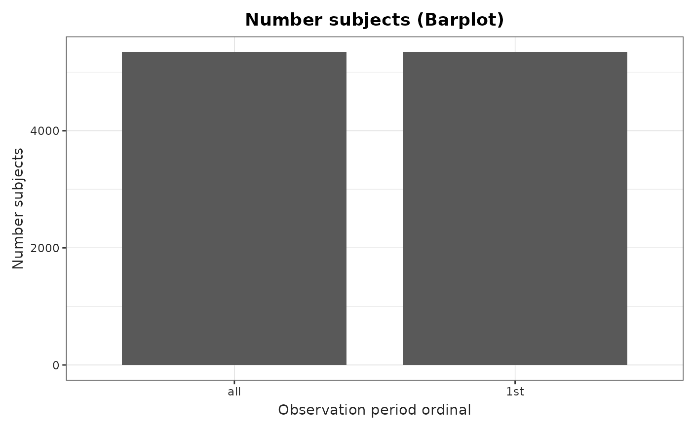
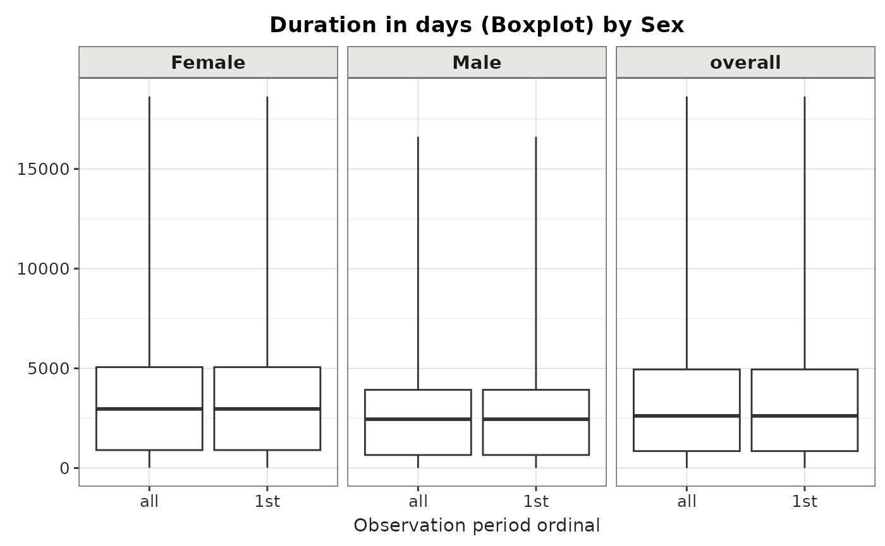
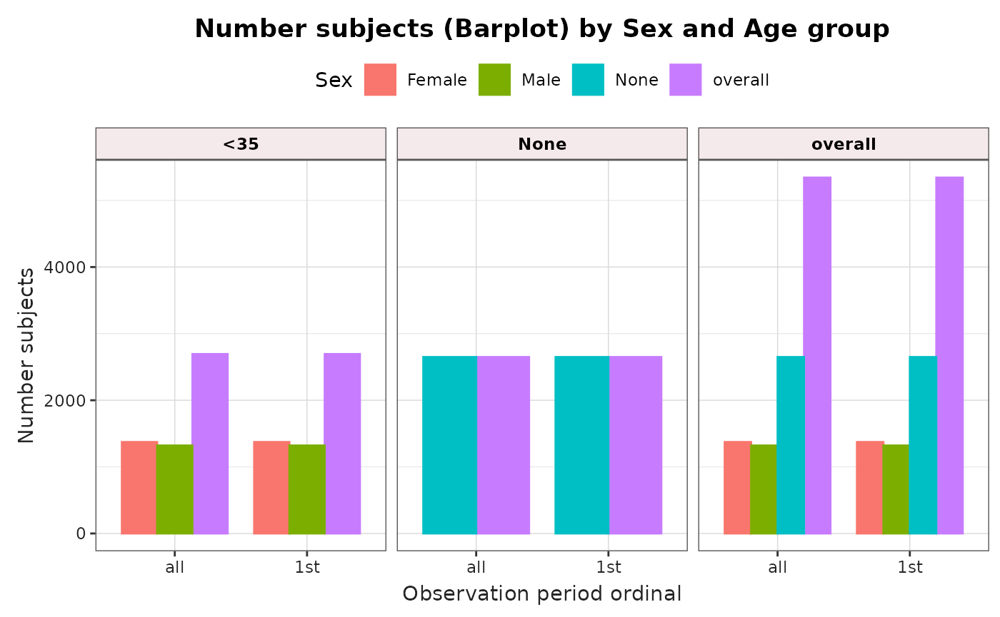

# Summarise observation period

## Introduction

In this vignette, we will explore the *OmopSketch* functions designed to
provide an overview of the `observation_period` table. Specifically,
there are 3 key functions that facilitate this:

- [`summariseObservationPeriod()`](https://OHDSI.github.io/OmopSketch/reference/summariseObservationPeriod.md):
  get some overall statistics describing the `observation_period` table
- [`plotObservationPeriod()`](https://OHDSI.github.io/OmopSketch/reference/plotObservationPeriod.md):
  create plots showing the results
- [`tableObservationPeriod()`](https://OHDSI.github.io/OmopSketch/reference/tableObservationPeriod.md):
  display the results in a formatted table

### Create a mock cdm

Let’s see an example of its functionalities. To start with, we will load
essential packages and create a mock cdm using the mockOmopSketch()
database.

``` r
library(dplyr)
#> 
#> Attaching package: 'dplyr'
#> The following objects are masked from 'package:stats':
#> 
#>     filter, lag
#> The following objects are masked from 'package:base':
#> 
#>     intersect, setdiff, setequal, union
library(OmopSketch)

# Connect to mock database
cdm <- mockOmopSketch()
#> ℹ Reading GiBleed tables.
```

## Summarise observation periods

Let’s now use the
[`summariseObservationPeriod()`](https://OHDSI.github.io/OmopSketch/reference/summariseObservationPeriod.md)
function from the **OmopSketch** package to generate an overview of the
`observation_period` table.  
This function provides both a general summary of the table and some
detailed statistics, such as the **Number of subjects** and the
**Duration in days** for each observation period (e.g., first, second,
etc.).

``` r
summarisedResult <- summariseObservationPeriod(cdm = cdm)

summarisedResult
#> # A tibble: 3,126 × 13
#>    result_id cdm_name       group_name      group_level strata_name strata_level
#>        <int> <chr>          <chr>           <chr>       <chr>       <chr>       
#>  1         1 mockOmopSketch observation_pe… all         overall     overall     
#>  2         1 mockOmopSketch observation_pe… all         overall     overall     
#>  3         1 mockOmopSketch observation_pe… all         overall     overall     
#>  4         1 mockOmopSketch observation_pe… all         overall     overall     
#>  5         1 mockOmopSketch observation_pe… all         overall     overall     
#>  6         1 mockOmopSketch observation_pe… all         overall     overall     
#>  7         1 mockOmopSketch observation_pe… all         overall     overall     
#>  8         1 mockOmopSketch observation_pe… all         overall     overall     
#>  9         1 mockOmopSketch observation_pe… all         overall     overall     
#> 10         1 mockOmopSketch observation_pe… all         overall     overall     
#> # ℹ 3,116 more rows
#> # ℹ 7 more variables: variable_name <chr>, variable_level <chr>,
#> #   estimate_name <chr>, estimate_type <chr>, estimate_value <chr>,
#> #   additional_name <chr>, additional_level <chr>
```

Notice that the output is in the [summarised
result](https://darwin-eu.github.io/omopgenerics/articles/summarised_result.html)
format.

We can use the function arguments to specify which summary statistics to
compute. For instance, the estimates argument allows us to define which
estimates we want to calculate for variables such as the Duration in
days of the observation period or the Number of records per person.

``` r
summarisedResult <- summariseObservationPeriod(
  cdm = cdm,
  estimates = c("mean", "sd", "q05", "q95")
)

summarisedResult |>
  filter(variable_name == "Duration in days") |>
  select(group_level, variable_name, estimate_name, estimate_value)
#> # A tibble: 8 × 4
#>   group_level variable_name    estimate_name estimate_value  
#>   <chr>       <chr>            <chr>         <chr>           
#> 1 all         Duration in days mean          3459.34         
#> 2 all         Duration in days sd            3586.96925956871
#> 3 all         Duration in days q05           45              
#> 4 all         Duration in days q95           9766            
#> 5 1st         Duration in days mean          3459.34         
#> 6 1st         Duration in days sd            3586.96925956871
#> 7 1st         Duration in days q05           45              
#> 8 1st         Duration in days q95           9766
```

By default, the function returns statistics for the **Number of
subjects**, **Duration in days**, and **Days to next observation** both
overall and by each ordinal observation period (for example, first,
second, etc.).

If we are only interested in overall statistics rather than those broken
down by ordinal period, we can set the argument `byOrdinal = FALSE`:

``` r
summarisedResult <- summariseObservationPeriod(
  cdm = cdm,
  estimates = c("mean", "sd", "q05", "q95"), 
  byOrdinal = FALSE
)

summarisedResult |>
  filter(variable_name == "Duration in days") |>
  distinct(group_name, group_level)
#> # A tibble: 1 × 2
#>   group_name                 group_level
#>   <chr>                      <chr>      
#> 1 observation_period_ordinal all
```

### Missingness

When the argument `missingData = TRUE` is set, the results will include
an overall summary of missing data in the table, including the number of
`0`s in the concept columns. This output is analogous to the results
produced by the OmopSketch function
[`summariseMissingData()`](https://OHDSI.github.io/OmopSketch/reference/summariseMissingData.md).

``` r
summarisedResult <- summariseObservationPeriod(
  cdm = cdm,
  estimates = c("mean", "sd", "q05", "q95"), 
  missingData = TRUE
)

summarisedResult |>
  filter(variable_name == "Column name") |>
  select(group_level, variable_name, estimate_name, estimate_value)
#> # A tibble: 16 × 4
#>    group_level variable_name estimate_name   estimate_value
#>    <chr>       <chr>         <chr>           <chr>         
#>  1 all         Column name   na_count        0             
#>  2 all         Column name   na_percentage   0.00          
#>  3 all         Column name   zero_count      0             
#>  4 all         Column name   zero_percentage 0.00          
#>  5 all         Column name   na_count        0             
#>  6 all         Column name   na_percentage   0.00          
#>  7 all         Column name   zero_count      0             
#>  8 all         Column name   zero_percentage 0.00          
#>  9 all         Column name   na_count        0             
#> 10 all         Column name   na_percentage   0.00          
#> 11 all         Column name   na_count        0             
#> 12 all         Column name   na_percentage   0.00          
#> 13 all         Column name   na_count        0             
#> 14 all         Column name   na_percentage   0.00          
#> 15 all         Column name   zero_count      100           
#> 16 all         Column name   zero_percentage 100.00
```

### Quality

When the argument `quality = TRUE` is set, the results will include a
quality assessment of the observation period table.  
This assessment provides information such as:

- Issues with date columns (e.g., start dates occurring after end dates,
  or dates preceding a subject’s birth date).  
- The presence of `person_id` values that do not exist in the `person`
  table.
- A summary of the types of concept_id available in the table.

``` r
summarisedResult <- summariseObservationPeriod(
  cdm = cdm,
  estimates = c("mean"), 
  missingData = FALSE, 
  quality = TRUE
)

summarisedResult |>
  
  select(group_level, variable_name, variable_level, estimate_name, estimate_value)
#> # A tibble: 14 × 5
#>    group_level variable_name         variable_level estimate_name estimate_value
#>    <chr>       <chr>                 <chr>          <chr>         <chr>         
#>  1 all         Records per person    NA             mean          1             
#>  2 all         Duration in days      NA             mean          3459.34       
#>  3 1st         Duration in days      NA             mean          3459.34       
#>  4 all         Number records        NA             count         100           
#>  5 all         Number subjects       NA             count         100           
#>  6 1st         Number subjects       NA             count         100           
#>  7 all         Type concept id       Unknown type … count         100           
#>  8 all         Subjects not in pers… NA             count         0             
#>  9 all         Subjects not in pers… NA             percentage    0.00          
#> 10 all         End date before star… NA             count         0             
#> 11 all         Start date before bi… NA             count         0             
#> 12 all         Type concept id       Unknown type … percentage    100.00        
#> 13 all         End date before star… NA             percentage    0.00          
#> 14 all         Start date before bi… NA             percentage    0.00
```

### Strata

It is also possible to stratify the results by sex and age groups:

``` r
summarisedResult <- summariseObservationPeriod(
  cdm = cdm,
  estimates = c("mean", "sd", "q05", "q95"),
  sex = TRUE,
  ageGroup = list("<35" = c(0, 34), ">=35" = c(35, Inf)),
)
```

Notice that, by default, the “overall” group will be also included, as
well as crossed strata (that means, `sex == "Female"` and
`ageGroup == "\>35"`).

### Tidy the summarised object

[`tableObservationPeriod()`](https://OHDSI.github.io/OmopSketch/reference/tableObservationPeriod.md)
will help you to create a table (see supported types with:
visOmopResults::tableType()). By default it creates a
[gt](https://gt.rstudio.com/) table.

``` r
summarisedResult <- summariseObservationPeriod(
  cdm = cdm,
  estimates = c("mean", "sd", "q05", "q95"),
  sex = TRUE
)

summarisedResult |>
  tableObservationPeriod(type = "gt")
```

[TABLE]

Summary of observation_period table

### Visualise the results

Finally, we can visualise the result using
[`plotObservationPeriod()`](https://OHDSI.github.io/OmopSketch/reference/plotObservationPeriod.md).

``` r
summarisedResult <- summariseObservationPeriod(cdm = cdm)

plotObservationPeriod(
  result = summarisedResult,
  variableName = "Number subjects",
  plotType = "barplot"
)
```



Note that either `Number subjects` or `Duration in days` can be plotted.
For `Number of subjects`, the plot type can be `barplot`, whereas for
`Duration in days`, the plot type can be `barplot`, `boxplot`, or
`densityplot`.”

Additionally, if results were stratified by sex or age group, we can
further use `facet` or `colour` arguments to highlight the different
results in the plot. To help us identify by which variables we can
colour or facet by, we can use
[visOmopResult](https://darwin-eu.github.io/visOmopResults/) package.

``` r
summarisedResult <- summariseObservationPeriod(cdm = cdm, sex = TRUE)
plotObservationPeriod(
  result = summarisedResult,
  variableName = "Duration in days",
  plotType = "boxplot",
  facet = "sex"
)
```



``` r

summarisedResult <- summariseObservationPeriod(
  cdm = cdm,
  sex = TRUE,
  ageGroup = list("<35" = c(0, 34), ">=35" = c(35, Inf))
)
plotObservationPeriod(summarisedResult,
  colour = "sex",
  facet = "age_group"
)
```



Finally, we can disconnect from the cdm.

``` r
CDMConnector::cdmDisconnect(cdm = cdm)
```
